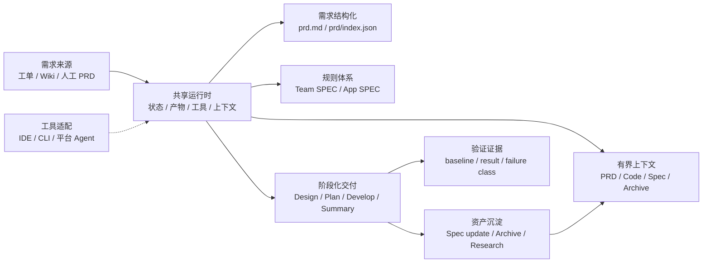
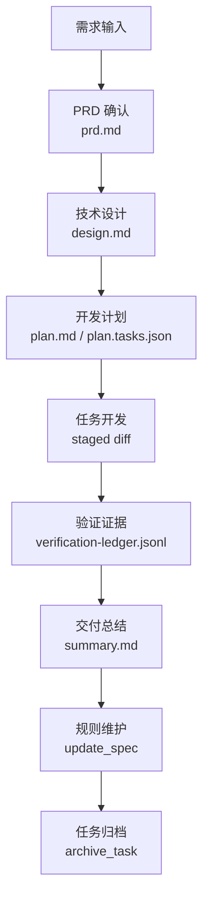

# 个人会用 AI Coding，为什么团队还是用不好？

## 引言

很多团队第一次看到 AI Coding 的效果，往往来自某个研发同学的个人实践：他把需求贴给模型，让模型帮忙读代码、生成实现、补测试，再自己做几轮修正，最后确实比过去快。这个过程很容易让团队产生一个判断：既然个人已经能提效，那接下来只要多推广工具、多沉淀 Prompt、多做几个 Agent，团队效率自然会起来。

真实情况通常没这么顺。个人会用 AI Coding，依赖的是个人对业务、代码、测试和风险的综合判断。这个人知道哪些上下文该给，知道模型哪里容易胡说，也知道测试失败是不是历史问题。换一个人、换一个应用、换一个需求规模，结果就会波动。团队真正要解决的，不是“让模型更聪明一点”，而是把个人临场判断里可工程化的部分固定下来。

团队 AI Coding 的关键转折点，是从“会用工具”走向“有工程系统承接工具”。需求从哪里来、PRD 是否确认、规则放在哪里、上下文如何选择、设计和计划怎么审查、验证证据如何记录、历史经验怎么沉淀，这些问题如果都靠人临场补救，AI Coding 就只能停留在个人经验层。

这个系列把这类系统称为 **团队 AI Coding 工程化框架**。它不是某个具体产品名，而是一组工程边界：共享运行时、任务状态、稳定产物、规则体系、有界上下文、复杂需求拆分、验证证据、资产沉淀和协作审查。下面用一个通用的实践样本来拆解这些边界如何落到目录、命令、产物和数据结构里。

> 一句话结论：**AI Coding 的团队化问题，不是 Prompt 问题，而是工程系统问题。**

## 一个典型场景：个人能跑通，团队接不住

假设一个业务团队要做“新增奖品权益类型”。熟悉该应用的研发 A 用 AI Coding 很顺：

- 他知道 PRD 里“权益类型”和代码里的 `PrizeType` 不是完全一一对应。
- 他知道新增类型不能只改枚举，还要看配置生成、查询展示、回滚兼容。
- 他知道历史测试里有一个用例长期失败，本次不用被它阻塞。
- 他知道哪个 Service 是主入口，哪些 Controller 只是薄封装。

所以他能把上下文裁剪得很准，模型输出也容易被他修正。但如果把同一个需求交给研发 B，或者交给另一个应用团队，问题就会出现：

- B 不知道要补哪些业务规则，只能把整篇 PRD 和一堆代码塞给模型。
- 模型生成的方案看起来完整，但没有说明哪些存量行为不能变。
- 计划按 Controller、Service、DAO 拆任务，看起来很工程化，但没有对应业务验收。
- 测试失败后，模型说“可能是历史失败”，但没有改前 baseline 证据。
- 需求完成后，关键经验只留在聊天记录和 PR 评论里，下次还要重新解释。

这不是某个人不会用 AI，而是团队缺少一个承接层。个人经验里有很多可以系统化的东西：规则可以结构化，需求可以切片，上下文可以选择，验证可以留证据，交付可以归档。团队 AI Coding 的建设重点，就是把这些东西从个人脑子里拿出来，变成团队共享的工程资产。

## 常见误区

团队推进 AI Coding 时，常见误区有五类。

| 误区 | 短期看起来 | 长期问题 |
|---|---|---|
| 每个应用各写一套 Agent | 贴近业务，启动快 | 通用流程重复建设，行为不一致，维护成本随应用数线性上升 |
| 规则全部塞进 Prompt | Agent 初期效果明显 | Prompt 越来越长，规则过期无人发现，无法审查来源 |
| 直接让 AI 改代码 | 交互简单 | 缺少 PRD、设计、计划和验证边界，大 diff 难评审 |
| 上下文越多越好 | AI 看起来知道更多 | 无关信息淹没关键约束，成本上升，输出不稳定 |
| 测试失败靠口头解释 | 进度不被阻塞 | 分不清历史失败和本次回归，质量判断不可审计 |

这些误区背后是同一个问题：团队没有把 AI Coding 纳入工程系统，而是把它当成一个更强的聊天窗口。

## 团队 AI Coding 要补的八类能力

从个人使用走到团队使用，至少要补齐八类能力。

| 能力 | 解决的问题 | 工程边界 |
|---|---|---|
| 共享运行时 | 避免每个应用重复建设 Agent | 统一任务状态、工具、产物、上下文目录 |
| 状态真相源 | 避免任务依赖聊天上下文 | 当前任务指针、任务 JSON、阶段状态 |
| 稳定阶段产物 | 让交付过程可审查 | PRD、设计、计划、总结、验证证据 |
| 规则体系 | 避免 Prompt 人工维护失控 | Team SPEC、App SPEC、route page、focused Spec |
| 有界上下文 | 避免全仓扫描和信息过载 | PRD working set、code working set、selected rules |
| 复杂需求拆分 | 避免大 PRD 直接变成大 diff | 功能切片、需求契约、必要时分片交付 |
| 验证治理 | 避免测试失败靠口头判断 | 改前 baseline、改后验证、失败分类、ledger |
| 资产沉淀 | 让每次交付反哺下一次任务 | summary、Spec update、archive recall、research artifact |

这些能力不是一次性做全的平台功能，而是一套可以逐步建设的工程边界。先把状态、产物、规则、验证这几件事固化下来，团队 AI Coding 才有持续演进的基础。

## 一个工程化框架的整体结构

团队 AI Coding 工程化框架的核心做法，是把 AI Coding 组织成一套项目内共享运行时。运行时承接通用流程，应用差异进入应用规则和历史案例，不同 AI 工具通过适配层接入。



对应到目录，一个通用实践样本可以这样组织：

```text
.team-agent/
├── .current-task
├── config.json
├── workflow/
│   └── phase-contracts.json
├── tools/
│   ├── task.js
│   ├── build-prd.js
│   ├── prd-context.js
│   ├── code-index.js
│   ├── context-selection.js
│   └── spec-context.js
├── spec/
│   ├── team/
│   └── app/
├── code-index/
│   └── index.json
└── tasks/
    ├── {taskId}/
    │   ├── task.json
    │   ├── prd.md
    │   ├── design.md
    │   ├── plan.md
    │   ├── plan.tasks.json
    │   ├── summary.md
    │   ├── generated/context/
    │   ├── evidence/verification-ledger.jsonl
    │   └── context/archive-recall.json
    └── archive/
        └── index.jsonl
```

这套结构里有几个关键分工：

- `.current-task` 和 `task.json` 承接任务状态。
- `prd.md`、`design.md`、`plan.md`、`summary.md` 是稳定阶段产物。
- `generated/context/*.jsonl` 是可重建上下文，不是新的状态真相源。
- `spec/**` 承接团队和应用规则。
- `evidence/verification-ledger.jsonl` 承接验证证据。
- `archive/index.jsonl` 承接已完成任务的历史案例索引。

这些名字都不是重点。重点是把“状态、产物、规则、上下文、证据、归档”分开。只要边界清楚，目录名可以换成 `.ai-agent/`、`.coding-agent/` 或团队自己的平台目录。

## 状态真相源：任务不能依赖聊天记忆

个人使用 AI Coding 时，经常靠当前聊天窗口维持上下文。团队场景里，这很危险：会话断了、工具换了、人换了，任务就很难恢复。

一个最小 `task.json` 可以长这样：

```json
{
  "taskId": "REQ-123456",
  "workflowKind": "feature",
  "currentStepId": "tech_design",
  "status": "in_progress",
  "branch": "feature/prize-type",
  "artifacts": {
    "prd": "prd.md",
    "design": "design.md",
    "plan": "plan.md",
    "summary": "summary.md"
  },
  "meta": {
    "contextMode": "expanded",
    "contextRisks": ["large_prd", "multi_domain"]
  }
}
```

这个 JSON 不需要承载所有过程细节，它只保存任务恢复和流程推进必须知道的事实。上下文选择、代码索引、验证证据这类可重建或可追加的信息，应放在自己的产物里，不要都塞回任务状态。

一个健康的状态模型要满足三个要求：

1. **可恢复**：换一个会话，能知道当前任务是谁、走到哪一步、下一步该读哪些产物。
2. **可审查**：任务状态里不能混入大量模型总结，关键事实要能追溯到具体 artifact。
3. **可清理**：任务归档后，active task 指针要清掉，临时诊断文件不能变成长期状态。

## 从聊天驱动到产物驱动

个人使用 AI Coding 时，常见交互是：“帮我看下这个需求”“帮我实现一下”“测试失败你看下”。这种方式对熟悉上下文的人有效，但团队协作时很难交接和审查。

团队级流程需要把关键节点产物化：



这个流程并不是为了增加仪式感，而是为了回答团队协作中的具体问题：

- 需求是否被确认过？
- 技术方案是否能被负责人审查？
- 开发计划是否拆到可执行 task？
- 每个 task 是否有验证命令和通过证据？
- 失败测试是否是历史问题？
- 这次交付有没有形成后续可用的规则或案例？

如果这些问题都只能从聊天记录里找答案，AI Coding 很难成为团队能力。

## 一个需求在框架里怎么流转

以“新增奖品权益类型”为例，完整流转可以拆成七个阶段。

| 阶段 | 输入 | 输出 | 人需要关注什么 |
|---|---|---|---|
| 需求结构化 | 工单、Wiki、人工 PRD | `prd.md`、`prd/index.json`、`prd/feature-*.md` | 需求范围是否清楚，功能点是否漏拆 |
| 规则选择 | PRD 切片、SPEC route page | selected SPEC refs | 是否命中业务规则，是否有设计前必须确认的问题 |
| 技术设计 | PRD、规则、代码 working set | `design.md` | 方案是否覆盖核心链路、兼容、数据、稳定性 |
| 开发计划 | `design.md`、代码引用 | `plan.md`、`plan.tasks.json` | task 是否可执行，是否有验证命令和验收标准 |
| 任务开发 | 单个 task、allowed paths | staged diff、验证记录 | diff 是否只覆盖当前 task，是否满足验收 |
| 交付总结 | diff、验证证据、计划完成情况 | `summary.md` | 这次改动的边界、风险和后续事项 |
| 资产沉淀 | summary、历史问题、规则变化 | SPEC 更新、archive index | 哪些经验下次还要用 |

这套流转的目的不是让 AI 每一步都自动化，而是让人和 AI 围绕同一批产物协作。AI 负责生成、搜索、初步修改和整理，人负责关键判断、边界确认和风险兜底。

## 低配版也能先跑起来

很多团队会担心：如果要做 code-index、selector、archive recall、workspace，听起来是不是太重。实际落地时可以从低配版开始。

```text
.team-agent/
├── current-task
├── spec/
│   ├── team/
│   └── app/
├── tasks/
│   └── {taskId}/
│       ├── task.json
│       ├── prd.md
│       ├── design.md
│       ├── plan.md
│       ├── plan.tasks.json
│       ├── summary.md
│       ├── context/
│       └── evidence/
└── archive/
    └── index.jsonl
```

第一阶段只要求做到：

1. 每个 AI Coding 任务都有任务目录。
2. 需求、设计、计划、总结落成 Markdown。
3. 团队规则和应用规则不要写死在 Prompt 中。
4. 每个 task 都记录验证命令和结果。
5. 交付结束后判断是否需要更新规则或归档案例。

这五件事做好后，再考虑自动选择上下文、自动召回历史案例、多工具适配和协作工作台。不要一开始就把系统做成大平台，否则团队还没有形成稳定习惯，维护成本已经先上来了。

## 建设顺序建议

一个比较稳的建设顺序是：

1. **先产物化**：固定 `prd.md`、`design.md`、`plan.md`、`summary.md`，让团队从聊天驱动切到产物驱动。
2. **再规则化**：把 Prompt 里的长期规则拆到 `spec/team` 和 `spec/app`，建立 route page 和 focused Spec。
3. **再上下文化**：让 PRD 切片、SPEC、代码引用和历史案例进入 working set，而不是全量塞给模型。
4. **再证据化**：建立改前 baseline、改后验证、失败分类和 ledger。
5. **最后协作化**：当产物和证据稳定后，再做 Feature Room、Review Request、指标看板等协作面。

这条路径的好处是每一步都有独立收益。即使团队暂时没有做复杂 Agent 编排，只要先把产物、规则和验证固定下来，AI Coding 的稳定性就会明显提升。

## 自查清单

可以用下面的问题判断团队是否还停留在个人使用阶段：

- 换一个人能否继续同一个 AI Coding 任务？
- 需求、设计、计划、验证证据是否有稳定文件？
- 应用规则是否主要写在 Prompt 或聊天模板里？
- 相似需求的历史经验能否被后续任务重新找到？
- AI 修改代码前是否知道当前测试 baseline？
- 一个大需求是否会先拆成功能点边界？
- 负责人审查的是 artifact 和 diff，还是只能看聊天记录？
- 更换 AI 工具时，任务状态和产物是否还能保留？

如果多数答案是否定的，优先建设共享运行时、SPEC 体系和阶段产物，而不是继续增加单点 Agent 数量。

## 思考与实践

1. 你们团队现在 AI Coding 最大的问题，是个人经验难复用、规则难维护、上下文失控，还是验证不清？
2. 如果让另一个同事明天接手你当前的 AI Coding 任务，他需要哪些文件才能继续？
3. 你们团队最应该先补的是任务状态、规则体系、上下文工程，还是验证证据？欢迎带着具体场景讨论。

## 结尾

团队 AI Coding 的核心挑战，不是让每个人都学会更复杂的提示词，而是让团队有一套稳定工程系统承接 AI 的输入、输出和沉淀。

个人提效靠技巧，团队稳定靠系统。下一篇进入共享运行时：为什么不要让每个应用都重复建设 Agent，以及团队最小任务目录应该如何承接状态、产物和验证证据。
