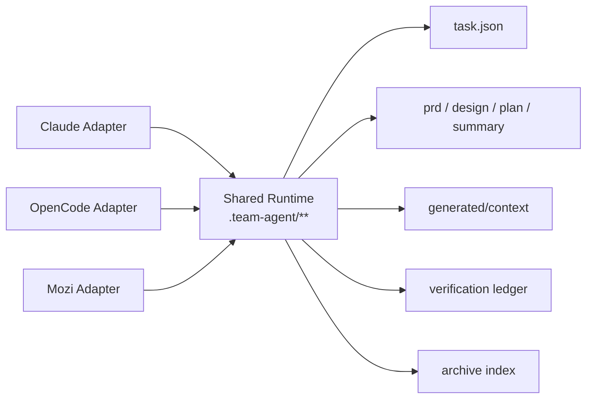

# 共享运行时：不要让每个应用都重复建设 Agent

## 引言

很多团队推进 AI Coding 时，会自然地从应用出发：订单应用写一套 Agent，营销应用写一套 Agent，结算应用再写一套 Agent。每套 Agent 都有自己的 Prompt、Command、Skill、规则文档和任务目录。短期看，这种方式贴近业务，启动也快；长期看，它会把团队拖进重复建设。

真正重复的部分并不是业务知识，而是需求进入、任务状态、阶段产物、上下文组织、验证证据和任务归档这些基础能力。如果每个应用都重新实现一遍，团队会很快遇到行为不一致、质量口径不统一、历史经验难复用、工具升级成本高的问题。

共享运行时的目标，是把通用交付能力放到一套稳定边界里。应用差异通过规则、案例和少量定制命令扩展，而不是每个应用都重写一套 Agent 系统。

> 一句话结论：**应用差异应该资产化，通用流程应该运行时化。**

## 常见误区

| 误区 | 表现 | 后果 |
|---|---|---|
| 按应用建设完整 Agent | 每个应用都有自己的流程、状态、规则和验证 | 通用能力重复实现，行为难统一 |
| 把运行时放进某个工具 | 任务状态只存在某个 IDE 插件或聊天工具里 | 换工具、换会话、换人后难恢复 |
| 只沉淀 Prompt，不沉淀产物 | Prompt 很强，但 PRD、设计、计划、验证都散落 | 交付过程不可审查 |
| 没有状态真相源 | 当前阶段靠聊天记忆判断 | 恢复、暂停、变更、归档都不可靠 |
| 运行时目录无限膨胀 | 每个能力都新增顶层文件 | 后期维护和归档成本上升 |

共享运行时要解决的是“通用交付能力应该放在哪里、由谁维护、如何被不同工具复用”。

## 设计原则

第一，**任务状态独立于 AI 工具**。Claude、OpenCode、Codex 或自研 IDE 插件都可以接入，但任务真相源不应该只存在某个工具的会话中。

第二，**稳定产物和派生产物分层**。PRD、设计、计划、总结是稳定产物；代码索引、上下文 JSONL、selector cache 是可重建产物。两类文件的 owner 和生命周期不能混在一起。

第三，**应用扩展不能破坏运行时边界**。应用可以有自己的 SPEC、Skill、Command，但不应该重新定义任务状态、阶段流程和验证证据格式。

## 案例拆解：一个共享运行时长什么样

这类框架通常会把共享运行时放在项目内 `.team-agent/` 目录。这个目录不属于某一个 Agent，也不属于某一个 AI 工具，而是所有适配层共同消费的任务工作区。

```text
.team-agent/
├── .current-task
├── config.json
├── workflow/
│   └── phase-contracts.json
├── tools/
│   ├── task.js
│   ├── build-prd.js
│   ├── code-index.js
│   ├── context-selection.js
│   └── spec-context.js
├── spec/
│   ├── team/
│   └── app/
├── code-index/
│   └── index.json
└── tasks/
    ├── {taskId}/
    │   ├── task.json
    │   ├── prd.md
    │   ├── design.md
    │   ├── plan.md
    │   ├── plan.tasks.json
    │   ├── summary.md
    │   ├── generated/context/
    │   ├── evidence/verification-ledger.jsonl
    │   └── context/archive-recall.json
    └── archive/
        └── index.jsonl
```

这套目录里有几类边界：

| 层级 | 代表文件 | 作用 |
|---|---|---|
| 任务指针 | `.team-agent/.current-task` | 指向当前 active task |
| 状态真相源 | `tasks/{taskId}/task.json` | 保存当前阶段、任务元信息、恢复所需状态 |
| 稳定产物 | `prd.md`、`design.md`、`plan.md`、`summary.md` | 给人和 Agent 审查的交付文档 |
| 派生产物 | `generated/context/*.jsonl`、`code-index/index.json` | 可由 builder 重建的上下文材料 |
| 执行证据 | `evidence/verification-ledger.jsonl` | 记录验证命令、结果、失败分类 |
| 规则资产 | `spec/team/**`、`spec/app/**` | 团队规则和应用差异 |
| 历史资产 | `tasks/archive/index.jsonl` | 已完成任务的案例索引 |

一个最小任务状态可以这样表达：

```json
{
  "taskId": "123456",
  "workflowKind": "feature",
  "status": "in_progress",
  "currentStepId": "plan_delivery",
  "branch": "feature/prize-type",
  "steps": [
    { "id": "tech_design", "status": "completed" },
    { "id": "plan_delivery", "status": "in_progress" },
    { "id": "develop_feature", "status": "pending" }
  ],
  "meta": {
    "contextMode": "expanded",
    "contextRisks": ["large_prd"]
  }
}
```

这个状态只保存流程恢复需要的信息。它不保存完整 PRD，不保存代码索引，不保存所有规则正文，也不保存测试日志全文。这些内容属于对应 artifact。

## 多工具为什么能共享运行时

共享运行时的一个重要价值，是把工具差异放到 adapter，而不是放到任务状态里。



在这个结构下，不同工具可以有自己的命令格式、hook 机制和上下文注入方式，但它们不重新定义任务目录。这样做有两个好处：

- 换工具时，任务状态和历史产物还能保留。
- 多个入口协作时，不会出现“这个工具认为任务完成，另一个工具不知道”的状态分裂。

## 运行时要避免什么

共享运行时不是把所有东西都塞进一个目录。它要控制文件预算和 owner。

| 不建议 | 原因 | 更合适的做法 |
|---|---|---|
| 每个阶段都新增顶层状态文件 | 状态来源变多，恢复逻辑复杂 | 统一写入 `task.json` 或阶段 artifact |
| 把 selector 结果写入任务状态 | 可重建上下文污染真相源 | 写入 cache 或 generated context |
| 把测试日志全文写入 `task.json` | 状态文件膨胀 | 写入 verification ledger 或 evidence 文件 |
| 把历史案例直接注入会话 | 上下文不可控 | 作为弱引用，在设计/计划前按预算召回 |
| 应用自定义流程覆盖主流程 | 团队质量口径不一致 | 应用通过 SPEC 和专项 Command 扩展 |

共享运行时越稳定，应用扩展越容易。反过来，如果运行时边界混乱，后续每个能力都会变成补丁。

## 团队参考做法

其他团队可以先定义一个最小运行时目录：

```text
.team-agent/
├── current-task
├── tools/
├── workflow/
├── spec/
│   ├── team/
│   └── app/
├── tasks/
│   └── {taskId}/
│       ├── task.json
│       ├── prd.md
│       ├── design.md
│       ├── plan.md
│       ├── plan.tasks.json
│       ├── summary.md
│       ├── context/
│       └── evidence/
└── archive/
    └── index.jsonl
```

第一阶段只做四个约束：

1. 所有任务必须进入统一任务目录。
2. 当前任务只通过 `current-task` 指向。
3. 需求、设计、计划、总结必须是稳定 artifact。
4. 上下文和验证证据不能只留在聊天里。

第二阶段再引入 code-index、context selector、archive recall、多工具 adapter 和 Web 协作工作台。不要一开始就做大平台。共享运行时最早要解决的是状态和产物，而不是复杂 UI。

## 检查清单

- 团队是否有统一任务目录？
- 当前任务是否能脱离聊天记录恢复？
- PRD、设计、计划、总结是否有稳定文件？
- 派生产物是否可以重建，而不是写死在任务状态里？
- 不同 AI 工具是否共享同一套任务状态？
- 应用差异是否通过 SPEC 扩展，而不是重写流程？
- 任务完成后是否进入 archive？
- 运行时目录是否有文件预算和 owner 规则？

## 思考与实践

1. 你们团队现在 AI Coding 的任务状态在哪里？聊天记录、Issue、PR，还是统一任务目录？
2. 如果新接入一个应用，你们会复制一套 Agent，还是复用同一套运行时后只补应用规则？
3. 你们最小可接受的 `.team-agent/` 目录应该包含哪些文件？

## 结尾

共享运行时是团队 AI Coding 的底座。没有它，Agent 越多，状态越散，经验越难沉淀。先把任务状态、阶段产物、规则、上下文和验证证据放到同一个工程边界里，后续的 SPEC、上下文选择、验证治理和协作面才有承载点。

下一篇进入 SPEC 体系：为什么团队规则不应该继续堆在 Prompt 里，以及如何让规则变成可检索、可审查、可维护的工程资产。
