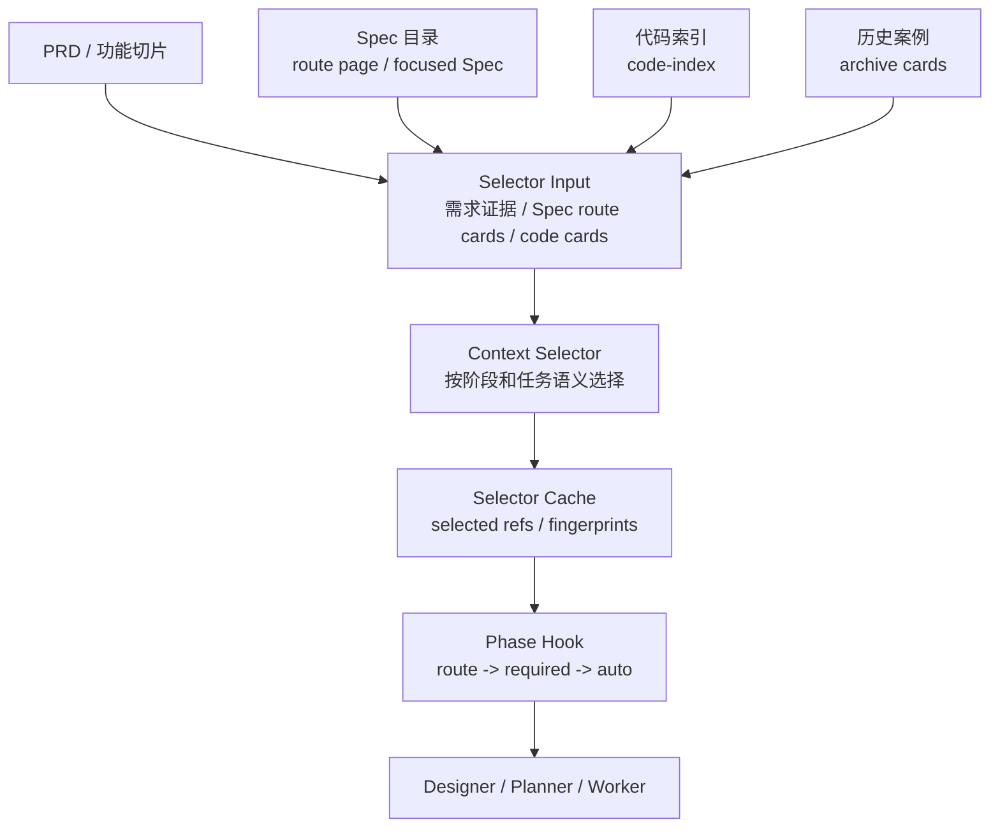
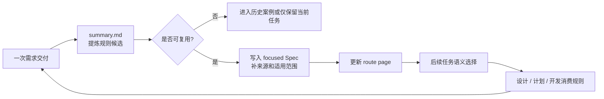
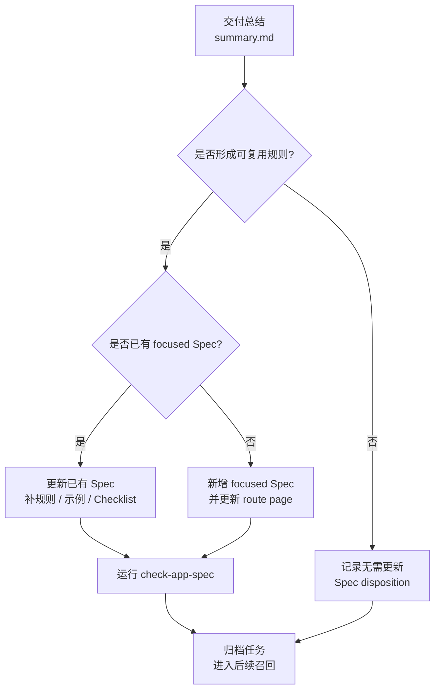

# SPEC 体系：把规则从 Prompt 里拿出来

很多团队刚开始做 AI Coding Agent 时，会把大部分规则写进 Prompt：代码风格、目录结构、日志要求、接口规范、业务规则、测试要求、上线注意事项都往里塞。这样做初期见效很快，因为 Agent 确实能在一次会话里“知道更多”。但随着应用增多、规则变多、业务变化变快，Prompt 很快会变成一个没人敢改、没人能审、也没人知道是否过期的大文件。

更麻烦的是，Prompt 往往会混在两类完全不同的内容：一类是执行流程，例如“先读 PRD，再写 design.md，再输出 JSON”；另一类是业务和工程知识，例如“新增奖品类型必须覆盖创建、查询、展示和回滚路径”。前者属于 Agent 行为契约，应该跟着工具和流程演进；后者属于团队知识资产，应该能被检索、审查、维护和复用。两类内容混在一起，后期一定会失控。

团队级 AI Coding 需要把长期规则从 Prompt 中剥离出来，形成可被 Agent 消费的 SPEC 体系。这里的 SPEC 可以理解为“面向 Agent 的项目知识库”，但它不是普通 Wiki 的搬运。一个可用的 SPEC 体系要有目录、路由、适用阶段、注入策略、来源说明和维护流程。

> 一句话结论：**Prompt 适合承接流程，SPEC 才适合承接团队知识。**

## 一、一个真实问题：Prompt 为什么会越写越乱

假设团队最初只有一个应用，Prompt 里写了这些规则：

- 代码必须遵循三层架构。
- Controller 不能写业务逻辑。
- 新增接口要补日志。
- 新增奖品类型要兼容存量类型。
- 退款需求要确认是否影响补偿链路。
- 单测失败要先判断是否历史失败。

这时看起来还可以。但当第二个应用接入时，问题出现了：第二个应用没有奖品类型，却有账户冻结和履约规则；第三个应用使用不同目录结构，日志规范也不一样。团队很容易走向两种做法：

1. 把所有规则继续塞进一个总 Prompt。
2. 每个应用复制一份 Prompt，然后各自修改。

第一种做法会让上下文越来越重，Agent 每次都读大量不相关规则。第二种做法会让同一条通用规则被复制到多个地方，后期维护时必然遗漏。更糟的是，交付过程中发现的新规则，经常只留在聊天记录、PR 评论或某个研发的脑子里，下一次需求又要重新解释。

SPEC 体系要解决的不是“文档不够多”，而是“团队知识没有工程边界”。

### 常见误区

| 误区 | 表现 | 后果 |
|---|---|---|
| 把规则都写进 Prompt | Prompt 越写越长，所有应用共享一份大规则 | 应用差异无法表达，规则过期后难发现 |
| 每个应用维护一套 Agent Prompt | A 应用一套，B 应用一套，C 应用一套 | 通用规则重复维护，行为不一致 |
| 把知识库当文档仓库 | Wiki 很全，但 Agent 不知道该读哪篇 | 检索和注入不可控，关键规则容易漏 |
| 把所有规则都强制注入 | 每次任务都加载全量规范 | 上下文预算浪费，不相关规则干扰判断 |
| 交付后不更新规则 | 踩坑经验留在聊天和 PR 里 | 下一次类似需求还要重新解释 |

规则体系的关键不是“文档更多”，而是让规则具备可路由、可选择、可验证、可演进的结构。

## 二、判断一条规则该不该进 SPEC

不是所有信息都应该沉淀成规则。很多团队的规则库失控，不是因为规则太少，而是因为把临时事实、一次性解释和长期规则混在一起。

可以用下面这张表判断：

| 内容 | 是否进 SPEC | 更合适的位置 |
|---|---|---|
| “新增权益类型必须覆盖创建、查询、展示路径” | 是 | `spec/app/business/` |
| “本次需求不做管理端入口” | 否 | 当前 `prd.md` 或 `design.md` |
| “这个应用使用 Maven，单测命令是 xxx” | 是 | `spec/app/engineering/` 或 `profile.md` |
| “这次测试环境 Redis 不稳定” | 否 | `verification-ledger` 或 `summary.md` |
| “接口字段 A 是历史兼容字段，不能删除” | 是 | `spec/app/domain/` 或 `business/` |
| “某次实现选择了方案 B，因为工期短” | 不一定 | 更适合 archive case |

一个简单标准是：**下一次类似需求开始前，是否希望 Agent 自动看到这条信息？** 如果是，就考虑进入 SPEC；如果只是本次任务事实，就不要污染长期规则。

### 设计原则

SPEC 体系设计可以遵循三条原则。

第一，**流程规则和知识规则分离**。Agent Prompt 负责执行机制，例如如何调用工具、如何输出 JSON、什么时候写 artifact；SPEC 负责可复用知识，例如业务不变量、工程规范、接口约束、测试要求。

第二，**团队规则和应用规则分层**。团队通用规则只维护一份，应用差异放到应用自己的 SPEC。不要因为某个应用有特殊业务，就复制一套完整 Agent。

第三，**规则按任务语义选择，不全量注入**。默认只注入路由页和必要硬规则，其他规则通过当前 PRD、代码上下文、阶段和 Agent 职责选择进入 working set。

## 三、SPEC 目录怎么设计

一个通用的 SPEC 目录可以分成两层：`team/` 是团队基线规则，`app/` 是具体业务应用的规则。

```text
.team-agent/spec/
├── team/
│   ├── index.md
│   ├── requirement.md
│   ├── architecture.md
│   ├── implementation-java.md
│   ├── middleware.md
│   ├── verification.md
│   └── delivery.md
└── app/
    ├── profile.md
    ├── index.md
    ├── .initialized.json
    ├── domain/
    │   └── index.md
    ├── business/
    │   └── index.md
    └── engineering/
        └── index.md
```

这套目录有几个明确边界：

- `spec/team/**` 承接团队基线规则，例如需求、设计、Java 实现、验证、交付。
- `spec/app/profile.md` 描述当前应用边界，例如应用名、技术栈、主要模块、测试入口。
- `spec/app/domain/**` 承接领域知识，例如订单、奖品、账户、履约等模型和不变量。
- `spec/app/business/**` 承接可复用业务需求开发规则，例如某类业务变更的流程、接口约束、设计前确认问题。
- `spec/app/engineering/**` 承接应用工程规范，例如分层目录、日志、异常、配置、测试、中间件接入。

应用级顶层目录建议保持封闭：只允许 `profile.md`、`index.md`、`.initialized.json`、`domain/`、`business/`、`engineering/`。封闭不是为了限制表达，而是为了防止知识目录越长越散，最后人和 Agent 都不知道规则应该放在哪里。

### Route Page 和 Focused Spec

SPEC 体系里有两类文件。

第一类是 **route page**，也就是路由页。它的职责是告诉 Agent 和人“有哪些规则，什么时候去读哪一篇”。`index.md` 属于 route page，不带 frontmatter，不承接大段规则正文。

一个业务规则路由页可以长这样：

```md
# Business Spec Index

## Overview

业务规则目录承接可复用业务需求开发规则、验收约束和设计前确认问题。

## Available Specs

| Spec | When To Use | Path |
|---|---|---|
| Prize Type Development | 涉及奖品类型、权益类型、奖品配置扩展 | `.team-agent/spec/app/business/prize-type.md` |
| Order Refund Policy | 涉及订单退款、撤销、补偿规则 | `.team-agent/spec/app/business/order-refund.md` |

## Quick Triggers

- 奖品类型、权益类型、配置生成、权益展示
- 退款策略、补偿策略、履约回滚

## Pre-Development Checklist

- 当前需求是否命中已有业务规则？
- 是否存在设计前必须确认的问题？

## Quality Check

- 路由页只做导航，不重复 focused Spec 正文。
```

第二类是 **focused Spec**，也就是聚焦规则。它承接某一个具体主题的规则、示例、DO / DON'T、Checklist 和来源。

```md
---
mode: auto
phases: tech_design,plan_delivery,develop_feature
agents: design-agent,plan-agent,task-worker
---

# Prize Type Development

> Purpose: 说明奖品类型扩展在当前应用中如何设计、计划和实现。

## Overview

奖品类型扩展涉及配置、识别、查询展示和兼容逻辑。新增类型时需要确认是否影响存量奖品、是否需要新增权益枚举、是否需要补充管理端配置。

## How To Apply

- `tech_design` 阶段先确认新增类型是否改变既有状态机。
- `plan_delivery` 阶段拆分配置、领域模型、接口展示和测试任务。
- `develop_feature` 阶段优先补充枚举映射、配置解析和回归测试。

## Rules

| Rule | Reason |
|---|---|
| 新增奖品类型必须有存量兼容策略 | 防止旧类型查询或展示行为变化 |
| 新增类型必须覆盖创建、查询、展示和回滚路径 | 避免只实现写入不实现读取 |

## DO / DON'T

DO:

- 先确认业务枚举和数据库存储值的对应关系。
- 为存量类型补回归测试。

DON'T:

- 不要只在接口层新增枚举，忽略配置生成和展示路径。
- 不要把一次性需求说明写成长期规则。

## Checklist

- [ ] 是否确认新增类型的业务含义？
- [ ] 是否确认存量类型行为不变？
- [ ] 是否补充创建、查询、展示测试？

## Source Reference

- 来源：历史需求总结、代码评审结论、业务方确认。
```

这类文件带三个 metadata：

| 字段 | 含义 |
|---|---|
| `mode` | 注入模式，`auto` 表示语义命中后注入，`required` 表示匹配阶段强制注入 |
| `phases` | 适用阶段，例如 `tech_design`、`plan_delivery`、`develop_feature` |
| `agents` | 适用 Agent，例如 designer、planner、task worker、reviewer |

`mode: required` 要谨慎使用，只适合短硬规则，并且规则正文应该放在 `## Runtime Rules` 下。大段业务知识、完整模块地图、通用背景说明都不应该强制注入。

### Required 和 Auto 怎么选

很多团队会把所有重要规则都标成 required，结果每次任务上下文都很重。更稳的做法是把“必须无条件遵守的短规则”和“命中语义后才展开的知识”分开。

| 类型 | 适合内容 | 不适合内容 | 示例 |
|---|---|---|---|
| `required` | 短硬规则、流程禁令、安全红线 | 大段业务背景、模块地图、案例说明 | “不得跳过 baseline 验证” |
| `auto` | 业务规则、领域知识、工程规范、案例化约束 | 每次都必须执行的流程动作 | “新增奖品类型的设计和验证要求” |

`required` 的正文最好只保留在 `## Runtime Rules` 下，几条就够。`auto` 才是大多数 focused Spec 的默认形态。这样 Agent 每次都能看到必要红线，但不会被大量不相关规则淹没。

## 四、规则如何进入 Agent 上下文

SPEC 不是全量写进 Prompt，而是经过选择后进入上下文。



在一个通用实现里，这条链路可以由几类工具和文件承接：

```text
runtime/templates/tools/spec-context.js
runtime/templates/tools/context-selection.js
runtime/templates/tools/task.js
.team-agent/cache/tasks/{taskId}/context-selection.json
```

一个简化后的 selector cache 可以长这样：

```json
{
  "phase": "tech_design",
  "agent": "design-agent",
  "selectedSpecRefs": [
    ".team-agent/spec/app/business/prize-type.md",
    ".team-agent/spec/app/engineering/api-contract.md"
  ],
  "recommendedBusinessSpecs": [
    ".team-agent/spec/app/business/prize-type.md"
  ],
  "confirmedBusinessSpecs": [
    ".team-agent/spec/app/business/prize-type.md"
  ],
  "fingerprints": {
    "selectorInput": "sha256:input",
    "selectorOutput": "sha256:output"
  }
}
```

这里的重点不是字段名，而是选择结果必须可追溯。Agent 在设计阶段读了哪些规则、为什么读这些规则、这些规则是否已经被负责人确认，都应该能从 cache 或对应产物中找到证据。

注入顺序建议采用 `route -> required -> auto`：

1. `route`：注入顶层和祖先 `index.md`，让 Agent 知道路由结构。
2. `required`：注入匹配当前阶段和 Agent 的硬规则，只取 `## Runtime Rules`。
3. `auto`：从 selector cache 的 selected refs 中按预算展开 focused Spec 正文。

这种做法解决两个问题：一方面，Agent 不会因为全量规则上下文过载；另一方面，选中的规则有来源、有路径、有选择结果，后续可以审查为什么这次任务读了这些规则。

### 一条规则从产生到复用的闭环

SPEC 不是写完就结束，它应该来自真实交付，再服务下一次交付。



这个闭环能避免两类问题：规则不是靠人拍脑袋定期整理，而是来自真实需求；规则也不是写进文档后没人用，而是会进入后续任务上下文。

### 设计前确认问题

SPEC 不只是告诉 Agent “怎么做”，也可以告诉流程“哪些问题必须先问清楚”。例如一个业务 focused Spec 里可以有这样的结构：

```md
## 设计前确认问题

1. 新增奖品类型是否允许存量订单查询展示？
2. 是否需要管理端配置入口？
3. 是否影响退款、补偿或履约回滚？
```

当当前需求命中这个 focused Spec 时，流程不应该直接进入技术设计，而是先把这些问题补齐。补齐后的答案应该写入 `design.md` 的前置事实区，例如：

```md
## 设计前置事实

- 新增奖品类型允许存量订单查询展示，展示名称沿用配置中心。
- 本次不新增管理端配置入口，只复用现有配置导入链路。
- 不影响退款和补偿链路，但需要补充查询展示回归测试。
```

这样做的价值很直接：业务规则不再只是“建议阅读”，而是能真正影响流程。缺关键事实时，Agent 不会自作主张生成方案。

### SPEC 什么时候维护

规则体系真正难的不是建目录，而是后期维护。可以把维护入口放在三个位置。

| 入口 | 使用场景 | 产物 |
|---|---|---|
| `/ai-init-spec` | 应用首次接入，初始化应用 SPEC 拓扑 | `profile.md`、根 `index.md`、三类子目录、`.initialized.json` |
| `update_spec` 阶段 | 一次 feature 交付结束后，判断是否有可复用规则 | 更新已有 focused Spec、推荐新增 Spec、或确认无需更新 |
| `/ai-spec-add` / `/ai-spec-update` | 任务外补充规则或修正规则 | 新增 focused Spec、更新 route page、修订已有 Spec |

每次变更 `spec/app/**` 后，都应该跑校验：

```bash
node .team-agent/tools/task.js check-app-spec
```

校验重点包括：

- app 顶层是否只包含允许的文件和目录。
- `profile.md` 和 focused Spec 是否带 `mode/phases/agents`。
- `index.md` 是否保持 route page，不误加 focused Spec frontmatter。
- `.initialized.json` 是否只在用户确认后写入。
- 业务规则是否放在 `business/`，工程规则是否放在 `engineering/`，领域知识是否放在 `domain/`。

维护动作的关键判断是：**这条信息下一次类似任务是否还应该被 Agent 使用？** 如果答案是肯定的，就应该进入 SPEC 或 archive；如果只是本次需求的临时事实，就留在 `prd.md`、`design.md` 或 `summary.md`。

### 交付结束后的规则维护流程

一次需求完成后，可以用下面的流程判断是否更新 SPEC。



几个判断标准可以帮助团队避免把 SPEC 写成垃圾桶：

| 内容 | 应该放哪里 | 原因 |
|---|---|---|
| 本次需求的临时事实 | `prd.md` / `design.md` | 只对当前任务有效 |
| 某类需求以后都要遵守的规则 | focused Spec | 后续任务需要自动消费 |
| 一次交付的取舍和踩坑 | `summary.md` / archive | 作为历史案例召回 |
| 代码文件的临时位置 | context / code refs | 可能随重构变化，不宜写成长期规则 |
| 团队统一工程规范 | `spec/team/**` | 不属于单个应用 |
| 应用业务不变量 | `spec/app/domain/**` 或 `business/**` | 属于应用知识资产 |

SPEC 维护要克制。一次需求结束后，如果没有形成可复用规则，可以明确记录“本次无需更新 SPEC”。强行为每个需求都新增规则，最后会让选择器和人都难以判断哪些规则重要。

### 一篇 focused Spec 的质量标准

一篇好的 focused Spec 不是“内容很全”，而是“能被后续任务正确使用”。

| 检查项 | 好的表现 | 差的表现 |
|---|---|---|
| 标题 | 对应一类业务或工程问题 | 对应某个文件名或一次需求名 |
| 适用范围 | 写清何时使用、何时不使用 | 只写背景介绍 |
| 规则 | 能指导设计、计划或实现 | 只有泛泛原则 |
| 示例 | 来自真实需求或代码约束 | 编造理想化例子 |
| Checklist | 能作为交付前检查 | 只是重复正文 |
| Source Reference | 能追溯来源 | 没有出处 |

如果一篇规则读完后，Agent 仍然不知道“当前任务该多做什么、少做什么、先确认什么”，这篇规则就还不够可执行。

## 五、团队参考做法

如果团队刚开始建设，可以先做一个简化版 SPEC 体系，不需要一开始就实现复杂 selector。

```text
.team-agent/spec/
├── team/
│   ├── index.md
│   ├── architecture.md
│   ├── implementation.md
│   ├── verification.md
│   └── delivery.md
└── app/
    ├── profile.md
    ├── index.md
    ├── domain/
    │   └── index.md
    ├── business/
    │   └── index.md
    └── engineering/
        └── index.md
```

第一阶段只做四件事：

1. Prompt 只保留流程、工具和输出格式。
2. 团队通用规则放到 `team/`。
3. 应用差异放到 `app/domain`、`app/business`、`app/engineering`。
4. 每次需求结束后，明确判断“是否需要更新规则”。

第二阶段再做语义选择：

1. 为每个 focused Spec 加 metadata。
2. 根据 PRD 关键词、模块、代码路径初步选择候选规则。
3. 在设计或计划阶段显示 selected refs，让负责人可以确认。
4. 逐步引入预算控制和 required/auto 注入。

先把规则从 Prompt 中拆出来，收益已经很明显；不要一开始就追求复杂的知识图谱。

### 常见坑

| 坑 | 表现 | 建议 |
|---|---|---|
| route page 里写大段正文 | index 越来越长，focused Spec 没人读 | index 只做导航和触发条件 |
| focused Spec 太细 | 每个接口、每个枚举都建一篇 | 一个 Spec 对应一类可复用规则，不对应代码文件 |
| required 过多 | 每次任务都注入很多硬规则 | required 只放短硬规则，其他用 auto |
| metadata 不维护 | 规则存在但选不中或总被选中 | 每次新增规则都确认 phases 和 agents |
| 规则没有来源 | 不知道这条规则为什么存在 | Source Reference 写历史需求、评审结论或业务确认 |
| 交付后只更新 summary | 后续任务找不到长期规则 | summary 负责案例，SPEC 负责长期规则 |

## 六、检查清单

可以用下面的问题检查团队 SPEC 体系是否健康：

- 团队规则是否还主要写在 Prompt 里？
- 同一条工程规范是否在多个应用 Agent 中重复维护？
- 应用业务规则是否有固定目录，而不是散在 Wiki 和聊天记录中？
- 每个规则文件是否能说明适用阶段、适用对象和来源？
- 是否区分 route page 和 focused Spec？
- 是否有“交付后是否更新规则”的固定动作？
- 变更规则后是否有校验机制？
- Agent 读取规则时是否能追溯“为什么读了这条规则”？

如果这些问题没有答案，优先建设 SPEC 目录和维护流程，再考虑更复杂的 Agent 能力。

## 七、思考与实践

1. 你们团队最常重复提醒给 AI 的三条规则是什么？它们现在写在 Prompt、Wiki、代码注释，还是有专门的规则文件？
2. 选一条近期反复踩坑的业务规则，试着判断它应该放在 `spec/team`、`spec/app/domain`、`spec/app/business` 还是 `spec/app/engineering`。
3. 如果每次需求结束都要判断“是否更新 SPEC”，你觉得团队最可能卡在哪一步？

## 八、结尾

SPEC 体系的目标不是让文档变多，而是让团队知识从聊天、Prompt 和个人经验中独立出来，成为 Agent 可以稳定消费、团队可以审查、后续可以维护的工程资产。

下一篇进入复杂需求拆分：当 PRD 足够大时，为什么不能直接把整篇需求交给 Agent，而要先变成功能点切片。
