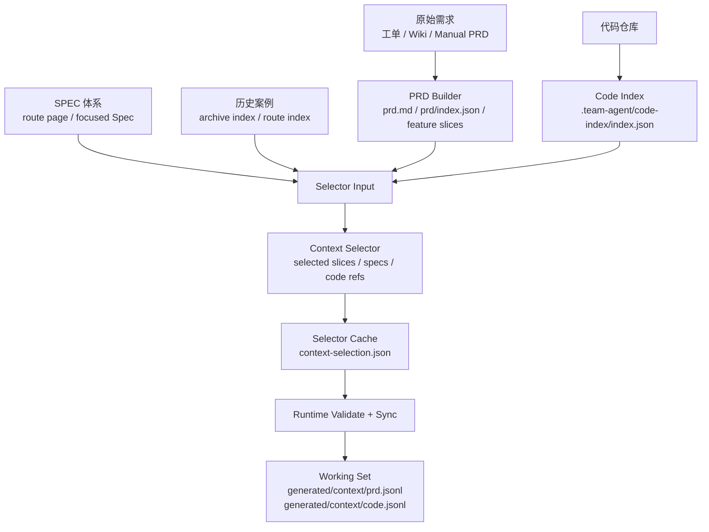

# 有界上下文：不是给 Agent 更多，而是给得更准

AI Coding 的一个常见误区是：模型效果不好，就继续塞上下文。PRD 全文、Wiki 全文、代码目录、团队规范、历史问题、接口文档都塞进去。结果是上下文窗口被大量无关内容占满，Agent 输出看似全面，但经常选错模块、漏掉关键约束，或者在相似概念之间混淆。

团队级 AI Coding 不能依赖“让 Agent 自己全仓搜索”。真实业务仓库里，代码量大、模块多、历史包袱多、规则也多。更稳定的做法是先把需求、代码、规则和历史案例变成可选择的候选，再为当前阶段生成刚好够用的 working set。

有界上下文的目标，不是少给信息，而是给准信息，并且让选择过程可追溯、可重建、可审查。

> 一句话结论：**上下文不是越多越好，而是越准越好。**

### 常见误区

| 误区 | 表现 | 后果 |
|---|---|---|
| PRD 全文每阶段都塞 | 设计、计划、开发都重读整篇需求 | 关键功能点被淹没，阶段成本高 |
| 让 Agent 全仓扫描 | 交给模型自己找相关代码 | 容易被同名类、旧模块、测试代码误导 |
| SPEC 全量注入 | 所有规范和业务规则都进上下文 | 预算浪费，不相关规则干扰判断 |
| 历史案例直接塞进会话 | 相似需求都作为背景材料 | 历史上下文过重，且无法判断是否适用 |
| 上下文失效不重建 | PRD 改了，仍沿用旧 working set | 设计、计划、实现基于过期事实 |

有界上下文的核心，是把“搜索和筛选”从 Agent 的临场发挥，变成运行时可观察的构建过程。

## 一、为什么“给更多上下文”会变差

模型不是不知道信息越多，而是很难判断哪些信息更重要。业务仓库里经常有同名类、历史实现、废弃接口、测试桩、临时兼容逻辑。全量上下文会让 Agent 看起来更“全面”，但实际更容易被噪音带偏。

| 上下文类型 | 常见噪音 | 风险 |
|---|---|---|
| PRD 全文 | 背景说明、历史沟通、非目标、技术建议 | 把未确认信息当需求 |
| 代码全仓 | 旧模块、测试桩、同名工具类、废弃入口 | 改错位置 |
| 规则全文 | 不相关业务规则、过期规范 | 忽略当前任务关键规则 |
| 历史案例 | 相似但边界不同的旧需求 | 套用错误方案 |

有界上下文的关键不是“少给”，而是给出证据优先级：当前 PRD 和确认事实优先，其次是命中的规则和代码，再其次才是历史案例。

### 设计原则

第一，**先结构化，再选择**。原始 PRD、代码、规则不能直接堆给 Agent，要先变成 feature、code card、Spec route card、archive card。

第二，**按阶段生成 working set**。设计阶段、计划阶段、开发阶段需要的上下文不同，不应该消费同一份大上下文。

第三，**上下文要可重建**。PRD 变化、代码变化、规则变化、历史召回变化后，working set 应该能通过命令重建，而不是手工修补。

第四，**历史案例只能弱引用**。历史案例用于提醒风险和复用思路，不能覆盖当前需求、当前规则和当前设计事实。

## 二、案例拆解：上下文构建流水线

这套框架的上下文构建可以分成 builder、selector、runtime 三层。



几类关键产物如下：

```text
.team-agent/
├── code-index/
│   └── index.json
├── cache/tasks/{taskId}/
│   └── context-selection.json
└── tasks/{taskId}/
    ├── prd/index.json
    ├── context/archive-recall.json
    └── generated/context/
        ├── prd.jsonl
        ├── code.jsonl
        ├── prd.slice-feature-01.jsonl
        └── code.slice-feature-01.jsonl
```

这条链路对应几个命令：

```bash
node .team-agent/tools/task.js build-code-index
node .team-agent/tools/task.js build-context-selection-input <taskId> --phase tech_design
node .team-agent/tools/task.js write-context-selection <taskId> <selection-json-path>
node .team-agent/tools/task.js sync-context <taskId>
```

`build-context-selection-input` 会把当前任务摘要、PRD feature slices、Spec route cards、business Spec candidates、archive case cards、code-index cards 和预算信息打包成 selector input。selector 输出后，runtime 会校验路径、预算、fingerprint 和引用合法性，再写入 selector cache。

### Selector Cache 长什么样

一个简化的 `context-selection.json` 可以长这样：

```json
{
  "phase": "tech_design",
  "selectedSlices": [
    {
      "id": "feature-01",
      "reason": "当前需求主要涉及新增权益类型识别"
    }
  ],
  "selectedCodeRefs": [
    {
      "path": "src/main/java/com/example/prize/PrizeTypeService.java",
      "reason": "处理奖品类型识别和配置生成"
    }
  ],
  "selectedSpecRefs": [
    ".team-agent/spec/app/business/prize-type.md"
  ],
  "selectedCases": [
    {
      "archiveId": "2026-05-01-prize-type-extension",
      "reason": "历史需求包含相同奖品类型扩展路径"
    }
  ],
  "fingerprints": {
    "selectorInput": "sha256:input",
    "selectorOutput": "sha256:output"
  }
}
```

这个文件不是任务状态真相源，而是上下文选择结果。它的价值是让后续阶段知道：这次为什么选了这些功能点、规则、代码和历史案例。

### Selector 也需要硬边界

如果团队引入模型做语义选择，要给 selector 明确边界。它只回答“哪些候选上下文相关”，不能顺手改状态、改产物或决定流程。

| Selector 可以做 | Selector 不应该做 |
|---|---|
| 从候选规则中选相关 Spec | 决定 required 规则是否生效 |
| 从 PRD 切片中选当前阶段相关切片 | 修改 PRD 内容 |
| 从 code index 中选候选代码路径 | 直接改代码 |
| 从历史案例中选弱参考 | 覆盖当前需求事实 |
| 输出路径、理由和置信度 | 推进 phase 或写 task 状态 |

这条边界能避免 selector 从“上下文选择器”变成另一个隐形调度者。

### Selector 输出必须被运行时校验

如果 selector 由模型完成，输出结果不能直接进入后续阶段。模型可以做语义判断，但引用合法性、路径边界和预算控制必须由确定性运行时校验。

| 输出 | 运行时应该校验什么 |
|---|---|
| `selectedSpecRefs` | 是否来自可发现的 SPEC route cards，是否匹配当前 phase / agent，是否超出预算 |
| `selectedSlices` | 是否引用已存在的 requirement / acceptance，是否超过切片数量限制，是否出现循环依赖 |
| `selectedCodeRefs` | 路径是否存在于 code index，是否落在切片允许路径内，是否重复 |
| `selectedCases` | 是否来自 archive index，是否在召回预算内 |
| `fingerprints` | selector input 和 output 是否能追溯，输入变化后是否需要重建 |

这层校验很关键。selector 可以是概率性的，但“引用是否合法、路径是否越界、上下文是否过期”不能靠模型自觉。否则有界上下文会变成另一种形式的自由发挥。

## 三、Working Set 如何被 Agent 使用

最终交给阶段 Agent 的不是 selector cache 本身，而是 JSONL working set。

`generated/context/prd.jsonl` 可以包含：

```json
{"type":"prd_overview","path":".team-agent/tasks/123456/prd/overview.md","summary":"新增奖品权益类型"}
{"type":"prd_slice","sliceId":"feature-01","path":".team-agent/tasks/123456/prd/feature-01.md","reason":"selected slice"}
```

`generated/context/code.jsonl` 可以包含：

```json
{"path":"src/main/java/com/example/prize/PrizeTypeService.java","reason":"selected code ref","symbols":["PrizeTypeService"]}
{"path":"src/test/java/com/example/prize/PrizeTypeServiceTest.java","reason":"local companion test","symbols":["PrizeTypeServiceTest"]}
```

这样做的好处是：Agent 先从有限证据开始，而不是默认全仓扫描；人可以检查 working set 是否选错；PRD 或代码变化后，可以通过 `sync-context` 重建；program mode 下可以生成 slice 专属 working set。

这里的 `selectedSlices` 不能只写一个切片 ID。更稳的做法是同时带上 `requirementRefs` 和必要的 `acceptanceRefs`，让后续阶段知道这个切片对应哪些需求契约和验收项。`selectedCodeRefs` 如果绑定了某个 slice，也要受该 slice 的路径边界约束，不能因为“看起来相关”就把全仓文件拉进来。

### Working Set 不是最终答案

working set 只是阅读入口，不是真相源。它应该告诉 Agent “先读这里”，而不是让 Agent 永远不回原文。

| 场景 | Agent 应该怎么做 |
|---|---|
| 写设计决策 | 先读 working set，再回看 `prd.md` 和相关规则原文 |
| 拆计划任务 | 使用 code working set，但验证真实文件和测试入口 |
| 修改代码 | 以 selected code refs 起步，必要时沿调用链扩展 |
| 判断验收 | 回到 PRD 切片和 acceptance，而不是只看摘要 |
| 判断历史案例 | 只作为参考，不能替代当前设计证据 |

如果 working set 摘要和原文冲突，以原文和已确认事实为准。

## 四、上下文失效和重建

有界上下文不是一次生成就永久有效。

| 变化 | 影响 | 动作 |
|---|---|---|
| PRD 范围变化 | feature slices、验收项、selected slices 可能过期 | 重建 PRD companion 和 context |
| 代码结构变化 | code-index 和 code working set 可能过期 | 重建 code-index 和 code context |
| SPEC 更新 | selectedSpecRefs 可能变化 | 重建 selector input 和 selector cache |
| 历史案例新增 | archive recall 可能变化 | 重跑 archive recall |
| 设计方案调整 | research artifact 或 working set 可能不再适用 | 判断复用或重建 |

这套框架里 `sync-context` 承担显式重建入口。它不是一个新的交付阶段，而是 builder rebuild orchestrator：当上游输入变化时，重新生成当前阶段需要的派生产物。

### 上下文质量怎么评估

有界上下文不是生成了 `prd.jsonl` 和 `code.jsonl` 就算完成，还要检查质量。

| 检查项 | 好的表现 | 风险信号 |
|---|---|---|
| PRD 覆盖 | 覆盖当前功能切片和验收项 | 只有任务标题，没有验收 |
| 代码覆盖 | 包含主实现入口、调用链、测试入口 | 只有 Controller 或只有接口定义 |
| 规则覆盖 | 命中业务规则和工程规则 | 只注入团队通用规范 |
| 历史案例 | 少量高相关弱参考 | 一次塞入大量旧任务 |
| 可重建性 | 输入变化后能重建 | 手工拼接，没人知道来源 |

如果设计阶段只看到 API 层代码，却看不到 service、repository、mapper、entity 或测试入口，就要警惕：上下文可能看起来相关，实际不足以支撑设计。

## 五、团队参考做法

其他团队可以先从最小上下文流水线开始：

```text
.team-agent/tasks/{taskId}/
├── prd/index.json
├── context-selection.json
└── context/
    ├── prd.jsonl
    └── code.jsonl
```

第一阶段只做四件事：

1. PRD 先拆成 overview 和 feature list。
2. 代码先生成简单 index，记录路径、模块、符号、测试文件。
3. 人或模型从 feature list、rule list、code index 中选出候选上下文。
4. 生成 `prd.jsonl` 和 `code.jsonl` 给设计、计划、开发使用。

不要一开始就追求复杂语义召回。先让上下文选择可见、可审查、可重建。

## 六、检查清单

- Agent 是否还在默认全仓扫描？
- PRD 是否被拆成 overview 和 feature slices？
- 代码是否有可排序的 index？
- SPEC 是否按任务语义选择，而不是全量注入？
- selector 输出是否经过运行时校验，而不是直接信任模型？
- 历史案例是否按预算召回，而不是直接塞进会话？
- working set 是否可以被人审查？
- PRD 或代码变化后，是否能显式重建上下文？
- selector 输出是否有路径、理由和 fingerprint？

## 七、思考与实践

1. 你们现在给 AI 上下文时，是手动复制，还是有明确的选择和预算机制？
2. 最近一次 AI 选错代码位置，是因为上下文太少，还是因为无关上下文太多？
3. 如果要先做一个低配版 working set，你会优先放 PRD 切片、代码索引、业务规则，还是历史案例？

## 八、结尾

有界上下文不是限制 Agent，而是让 Agent 从正确的证据开始工作。团队越复杂，越不能依赖模型临场搜索；越要把需求、代码、规则和历史案例变成可选择、可重建、可审查的 working set。

下一篇进入阶段化交付：为什么不能让 AI 从一句话直接改代码，以及 PRD、设计、计划、总结如何变成稳定产物。
