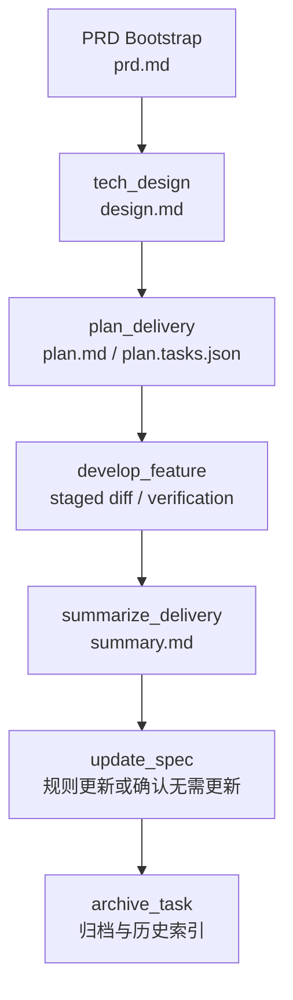
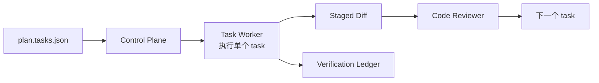

# 阶段化交付：别让 AI 从一句话直接改代码

个人使用 AI Coding 时，一句“帮我实现一下”可能足够。因为提出需求的人通常也熟悉代码，能在过程中判断模型是否跑偏。但团队交付不是这样。需求负责人、开发负责人、评审人、测试人可能不是同一个人，任务可能跨会话、跨天、跨工具继续。如果从一句话直接进入代码修改，后面很难回答：需求是否确认过，技术方案是否合理，计划是否可执行，验证是否覆盖，哪些经验应该沉淀。

阶段化交付的目标，不是把 AI Coding 变成繁重流程，而是把关键判断点产物化。团队不应该只审查聊天记录，而应该审查 PRD、设计、计划、diff、验证证据和总结。

> 一句话结论：**AI Coding 要进入团队流程，必须先从聊天结果变成可审查产物。**

### 常见误区

| 误区 | 表现 | 后果 |
|---|---|---|
| 需求没确认就设计 | Agent 基于工单摘要直接做方案 | 方案可能建立在错误需求上 |
| 设计没落文档 | 方案只存在聊天里 | 负责人难审查，后续难恢复 |
| 计划只是自然语言 | “先改 A，再改 B，最后测试” | worker 无法稳定执行，reviewer 无法检查 |
| 开发和验证混在一起 | 代码改完才想起测试 | 失败原因难分类 |
| 交付后不总结 | 代码合了就结束 | 规则和经验无法进入下一次任务 |

阶段化交付要解决的是：每个关键阶段都有稳定 artifact，且阶段之间有输入输出契约。

## 一、阶段化不是多问几次确认

很多人一听阶段化，就担心流程变慢。真正拖慢团队的不是产物，而是无效确认：每写一章问一次，每做一步问一次，用户只能不断点头。

好的阶段化有两个特征：

| 做法 | 说明 |
|---|---|
| 关键产物完整写出来再确认 | 让用户审 `design.md`、`plan.md`，不是审聊天摘要 |
| 确认点少但不可省 | PRD、设计、计划、风险选择、规则处置和归档前置条件 |

也就是说，阶段化不是“多打断用户”，而是“把真正需要人判断的地方做成可审查产物”。

### 设计原则

第一，**阶段产物优先于聊天结论**。PRD、设计、计划、总结必须落文件，聊天只作为交互通道。

第二，**每个阶段有明确输入和输出**。设计消费 PRD 和上下文，计划消费设计，开发消费计划，验证消费 task 和 diff。

第三，**确认点少但关键**。不需要每个小步骤都打断用户，但 PRD、设计、计划、Spec disposition、归档前置条件必须可审查。

## 二、案例拆解：阶段化主干

完整需求流的主干流程可以拆成：



任务目录中的稳定产物如下：

```text
.team-agent/tasks/{taskId}/
├── prd.md
├── design.md
├── plan.md
├── plan.tasks.json
├── summary.md
├── evidence/verification-ledger.jsonl
└── context/archive-recall.json
```

其中 `prd.md`、`design.md`、`plan.md`、`summary.md` 是 stable artifacts。它们不是临时上下文，也不是缓存，而是团队审查和恢复任务时的主要入口。

### 每个阶段的进入和退出条件

阶段化真正有用，必须有 gate。否则只是多几个文件名。

| 阶段 | 进入条件 | 退出条件 |
|---|---|---|
| PRD | 有需求来源或人工输入 | `prd.md` 已确认，范围和非目标清楚 |
| Design | PRD、规则、代码 working set 可用 | `design.md` 完整，重大风险和影响范围明确 |
| Plan | 设计已确认 | `plan.md` 和 `plan.tasks.json` 对齐，每个 task 可执行 |
| Develop | 计划已确认 | 每个 task 有 diff、验证证据和 review 结果 |
| Summary | 开发完成并有验证证据 | `summary.md` 包含范围、风险、验证和沉淀建议 |
| Spec / Archive | summary 完成 | 规则处置明确，历史案例归档，active task 清理 |

这些 gate 可以先人工执行，后续再自动化。关键是团队要知道什么时候不能继续往下走。

### PRD：需求真相源

PRD 阶段要回答：这次到底要做什么，来源是什么，是否已经被用户确认。

```md
# PRD: 新增奖品权益类型

## 需求信息

- 需求 ID: 123456
- 来源: Wiki
- 上下文模式: expanded

## 功能概览

支持新增权益类型识别、配置生成、查询展示，并保证存量权益类型行为不变。

## 功能切片

| Slice | Title | Acceptance |
|---|---|---|
| feature-01 | 新增权益类型识别 | 新权益类型可创建，存量类型行为不变 |

## 需求正文

这里保留用户确认后的需求正文。
```

PRD 阶段的关键不是写得漂亮，而是把需求真相和原始来源分开管理。原始来源可以追溯，确认后的 PRD 才进入后续交付。

PRD 里还要尽量写清楚非目标。很多 AI 跑偏不是因为不知道要做什么，而是不知道什么不做。

```md
## 非目标

- 本次不新增管理端配置入口。
- 本次不改退款补偿链路，只做回归验证。
- 本次不调整存量权益类型的展示文案。
```

### Design：技术方案产物

技术设计阶段要回答：用什么方案实现，影响哪些模块，有哪些风险，如何保证稳定性。

`design.md` 至少应该包含：

```md
# 技术设计

## 需求概述
## 整体设计
## 功能模块设计
## 数据模型设计
## 稳定性设计
## 影响范围
## 风险与回滚
## 变更记录
```

设计阶段建议采用 artifact-first：先写完整 `design.md`，通过 design reviewer 后，再进行一次最终确认。复杂图示、表格和方案细节必须写入 artifact，而不是只靠聊天确认。

一个设计文档是否“够团队审”，可以看它是否回答了这几个问题：

- 影响哪些已有接口、调用方、数据表、配置、消息或定时任务？
- 哪些存量行为必须保持不变？
- 是否有灰度、回滚或兼容策略？
- 哪些地方需要回归测试？
- 哪些信息还没确认，是否明确标成待确认？

### Plan：可执行计划

计划阶段要回答：怎么拆 task，每个 task 改哪些文件，怎么验证，失败和通过信号是什么。

一个简化的 `plan.tasks.json` 可以长这样：

```json
{
  "tasks": [
    {
      "id": "T1",
      "title": "新增权益类型枚举和映射",
      "featureId": "feature-01",
      "allowedPaths": [
        "src/main/java/com/example/prize/",
        "src/test/java/com/example/prize/"
      ],
      "verificationCommands": [
        "mvn test -Dtest=PrizeTypeServiceTest"
      ],
      "red": "新增测试先失败，证明当前不支持新权益类型",
      "green": "新增权益类型创建和查询测试通过",
      "regression": "存量权益类型回归测试通过",
      "expectedEvidence": ["测试命令输出", "verification-ledger 记录"],
      "acceptanceCriteria": ["新权益类型可创建", "存量权益类型行为不变"]
    }
  ]
}
```

计划必须可执行。只有“修改相关代码并补测试”这种描述，对 Agent 和 reviewer 都不够。

计划阶段最常见的问题是“看起来合理，但 worker 无法执行”。判断计划是否可执行，可以看每个 task 是否同时具备五件东西：`featureId`、`allowedPaths`、`verificationCommands`、`acceptanceCriteria`、`expectedEvidence`。缺任意一个，后续就容易变成自由发挥。

### Develop：按 Task 执行

开发阶段不应该把完整需求再次交给一个万能 Agent。更稳定的方式是：控制平面读取 `plan.tasks.json`，一次只分配一个 task 给 worker。



worker 只负责当前 task，不提交代码、不推进阶段、不修改任务状态。它返回 RED / GREEN / Regression 和验证证据后，控制平面再进行 staged diff review。

如果 worker 发现计划里的验证命令不存在，正确动作不是自己发明一个命令继续跑，而是把问题退回计划阶段。计划的命令、路径和验收标准属于 contract，执行端不能随意改 contract。

### Summary、Spec 和 Archive

代码写完不代表交付结束。团队 AI Coding 的尾部动作同样重要：

- `summary.md` 总结本次交付范围、改动、验证、风险和未解决问题。
- `update_spec` 判断是否需要更新团队或应用规则。
- `archive_task` 把完成任务写入历史索引，供后续相似需求召回。

简化的 archive index entry 可以是：

```json
{
  "taskId": "123456",
  "title": "新增奖品权益类型",
  "domain": ["奖品", "权益类型"],
  "changedAreas": ["PrizeTypeService", "PrizeConfig"],
  "risks": ["存量类型兼容"],
  "summaryPath": ".team-agent/tasks/archive/123456/summary.md"
}
```

这个尾部动作解决的是经验沉淀问题：相似需求下一次出现时，不需要从零解释历史上下文。

## 三、团队参考做法

其他团队可以先采用最小阶段化流程：

```text
需求确认 -> 设计 -> 计划 -> 开发 -> 验证 -> 总结 -> 规则维护 -> 归档
```

对应最小文件：

```text
.team-agent/tasks/{taskId}/
├── prd.md
├── design.md
├── plan.md
├── plan.tasks.json
├── summary.md
└── evidence/verification-ledger.jsonl
```

第一阶段要做到：

1. PRD 未确认，不进入设计。
2. 设计未落文档，不进入计划。
3. 计划没有 task、路径、验证命令，不进入开发。
4. 验证没有证据，不算 task 完成。
5. 总结和规则处置未完成，不算交付完成。

## 四、检查清单

- 需求是否有确认后的 PRD artifact？
- 技术方案是否有稳定设计文档？
- 计划是否拆到 task，并包含文件范围和验证命令？
- worker 是否一次只执行一个 task？
- code review 是否基于 staged diff？
- 验证结果是否进入 ledger？
- 交付总结是否包含范围、风险和验证？
- 是否有规则更新或明确无需更新的动作？

## 五、思考与实践

1. 你们现在 AI 生成的内容里，哪些应该从聊天记录变成稳定 artifact？
2. 最近一次 AI Coding 任务，如果换人接手，`design.md` 和 `plan.md` 是否足够支撑继续开发？
3. 你们团队更缺 PRD 确认、设计审查、计划拆分，还是交付总结？

## 六、结尾

阶段化交付不是给 AI Coding 加流程负担，而是让团队能够审查、恢复、验证和沉淀。没有稳定产物，AI Coding 只能是聊天能力；有了稳定产物，AI 才能进入团队研发流程。

下一篇进入 Task 化开发：如何把一个大 diff 拆成能被逐个验证和审查的工程任务。
