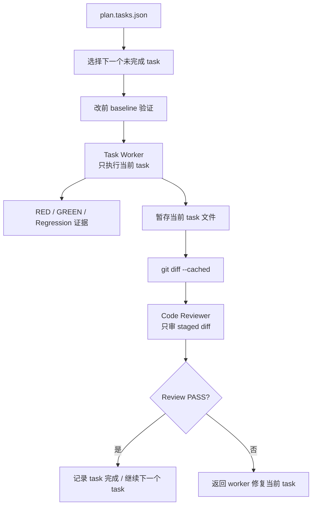

# Task 化开发：把大 Diff 拆成可审查的工程任务

AI Coding 最容易让团队紧张的地方，是它能很快生成一个很大的 diff。这个 diff 可能同时改接口、改 service、改配置、改测试、改文档。模型觉得自己“完成了需求”，但评审人面对的是一大坨变化：不知道每一处改动对应哪个需求点，也不知道哪些测试覆盖了哪些行为。

团队级 AI Coding 不能让开发阶段变成“Agent 自由发挥”。更稳定的做法是先把计划拆成 task，每个 task 有明确范围、允许修改路径、验证命令、失败信号、通过信号和验收标准。开发时一次只执行一个 task，审查时只审当前 staged diff。

Task 化开发的目标，是把大需求拆成可执行、可验证、可审查的小交付单元。

> 一句话结论：**团队不能接受一个不可控的大 diff，只能接受一组可验证的 task。**

### 常见误区

| 误区 | 表现 | 后果 |
|---|---|---|
| 计划只有自然语言 | “实现核心逻辑并补测试” | worker 不知道边界，reviewer 无法判断是否完成 |
| 一次性交给 Agent 完整需求 | Agent 自己决定改哪些文件 | 大 diff 难审查，风险集中 |
| 实现和测试拆成两个 task | 先实现，后补测试 | 中间状态不可验证，测试容易漏 |
| 没有 allowed paths | Agent 可以改任意文件 | 容易越界修改和顺手重构 |
| 没有失败/通过信号 | 只写“运行测试” | 无法判断验证是否覆盖新增行为 |

Task 化不是把任务拆碎，而是让每个小任务都能独立证明自己完成了什么。

## 一、什么样的 task 才算合格

很多计划看起来已经拆了 task，但其实只是把一句大需求拆成几句小描述。一个合格 task 至少要让 worker 和 reviewer 同时能回答下面的问题。

| 问题 | 必要字段 |
|---|---|
| 这个 task 服务哪个需求点？ | `featureId` / `requirementRefs` / `acceptanceCriteria` |
| 它必须遵守哪些长期规则？ | `specRefs` / rule refs |
| 它允许改哪些地方？ | `allowedPaths` |
| 它不应该改哪些地方？ | scope / excluded paths / plan 说明 |
| 怎么证明新增行为有效？ | GREEN 验证命令和 expected evidence |
| 怎么证明存量行为没坏？ | Regression 验证命令 |
| 失败时怎么判断是否阻塞？ | baseline 和 failure classification |

如果这些问题还需要 worker 临场判断，task contract 就还不够完整。

### 设计原则

第一，**每个 task 都要包含实现和验证**。不要把“写代码”和“补测试”拆成两个互相独立的 task。

第二，**每个 task 都要有修改边界**。allowed paths 和候选文件不是限制创造力，而是防止无关修改进入 diff。

第三，**每个 task 都要有证据要求**。RED、GREEN、Regression、Expected Evidence 和 Acceptance Criteria 必须写清楚。

## 二、案例拆解：plan.tasks.json

`plan_delivery` 阶段会产出 `plan.md` 和 `plan.tasks.json`。前者给人读，后者给运行时、worker 和 reviewer 使用。

```text
.team-agent/tasks/{taskId}/
├── plan.md
├── plan.tasks.json
└── evidence/verification-ledger.jsonl
```

一个简化 task 如下：

```json
{
  "id": "T1",
  "title": "新增权益类型枚举和配置解析",
  "featureId": "feature-01",
  "requirementRefs": ["REQ-001"],
  "specRefs": [".team-agent/spec/app/business/prize-type.md"],
  "dependsOn": [],
  "allowedPaths": [
    "src/main/java/com/example/prize/",
    "src/test/java/com/example/prize/"
  ],
  "verificationCommands": [
    "mvn test -Dtest=PrizeTypeServiceTest"
  ],
  "red": "新增权益类型解析测试在实现前失败",
  "green": "新增权益类型解析、配置生成测试通过",
  "regression": "存量权益类型解析回归测试通过",
  "expectedEvidence": [
    "RED 失败输出",
    "GREEN 通过输出",
    "verification-ledger 记录"
  ],
  "acceptanceCriteria": [
    "新权益类型可被识别",
    "配置生成包含新权益类型",
    "存量权益类型行为不变"
  ]
}
```

这个结构让 worker 和 reviewer 都有共同判断标准：改哪些范围、为什么改、遵守哪些规则、怎么证明。

`featureId` 只能说明 task 属于哪个功能切片，还不够细。`requirementRefs` 把 task 连接到机器可读的需求契约，`specRefs` 把 task 连接到长期业务规则或工程规则。这样 reviewer 看到 diff 时，不只是在问“是不是 feature-01”，还可以继续问“是否覆盖 REQ-001 的验收，是否符合对应 SPEC 的固定约束”。

### Task 不应该怎么拆

下面这些拆法很常见，但会让 AI 开发不稳定。

| 错误拆法 | 为什么有问题 | 更好的拆法 |
|---|---|---|
| `T1 实现逻辑`、`T2 补测试` | 实现阶段不可验证，测试容易变成补丁 | 每个 task 同时包含实现和验证 |
| `T1 修改 Controller`、`T2 修改 Service` | 按代码层拆，脱离业务验收 | 按功能点和验收项拆 |
| `T1 处理所有兼容问题` | 范围太泛，worker 会自由发挥 | 明确具体兼容行为和验证命令 |
| `T1 重构相关代码` | 容易夹带无关改动 | 只有需求需要时才允许重构，并写清边界 |
| `T1 跑全量测试` | 纯验证 task 不产生交付闭环 | 把验证绑定到对应实现 task |

好的 task 应该小到能审查，大到能闭环。它不是代码文件清单，而是一个可交付的小业务结果。

## 三、执行链路

Task 化开发的执行链路如下：



这里有几个关键约束：

- worker 不推进 phase。
- worker 不提交代码。
- worker 不修改全局任务状态。
- 控制平面一次只分配一个 task。
- reviewer 只审 staged diff，不审整仓状态。

这些约束可以避免一个 Agent 既执行又调度又自评审。

### Worker 返回结果也要结构化

worker 不应该只返回“完成了”。它至少要返回当前 task 的改动、验证和风险。

```json
{
  "taskId": "T1",
  "status": "completed",
  "changedFiles": [
    "src/main/java/com/example/prize/PrizeTypeService.java",
    "src/test/java/com/example/prize/PrizeTypeServiceTest.java"
  ],
  "verification": {
    "baseline": "passed",
    "green": "passed",
    "regression": "passed"
  },
  "evidencePaths": [
    ".team-agent/tasks/123456/evidence/verification-ledger.jsonl"
  ],
  "notes": [
    "存量权益类型行为通过回归测试"
  ]
}
```

如果证据不足，返回的也应该是结构化诊断，而不是继续扩范围修改。

```json
{
  "taskId": "T1",
  "status": "input_contract_unsatisfied",
  "missingEvidence": [
    "缺少查询展示路径的代码引用",
    "计划中的验证命令不存在"
  ]
}
```

## 四、Diff 审查看什么

Code reviewer 不只是看代码风格，而是把 diff 和 task contract 对齐。

| 审查项 | 问题 |
|---|---|
| 范围 | diff 是否只修改 allowed paths？ |
| 需求对应 | 每个核心改动是否能回到 featureId、requirementRefs 和 acceptance？ |
| 规则对应 | 实现是否遵守 task 绑定的 specRefs？ |
| 测试覆盖 | 新增行为是否有正向测试？ |
| 回归保护 | 存量行为是否有回归验证？ |
| 越界修改 | 是否顺手重构或修改无关文件？ |
| 验证证据 | ledger 是否记录对应命令和结果？ |
| 失败分类 | 失败是否被正确标记为新增失败或历史失败？ |

一个简化 review 结果可以是：

```json
{
  "taskId": "T1",
  "status": "FAIL",
  "findings": [
    {
      "severity": "major",
      "path": "src/main/java/com/example/prize/PrizeTypeService.java",
      "message": "新增类型只覆盖创建路径，查询展示路径未实现"
    }
  ],
  "requiredActions": [
    "补充查询展示路径实现",
    "补充对应回归测试"
  ]
}
```

存在 critical 或 major 问题时，当前 task 不应该进入完成状态。

### Review 严重级别要有标准

为了避免 reviewer 的判断太随意，可以先约定严重级别。

| 级别 | 含义 | 处理 |
|---|---|---|
| critical | 会导致需求错误、数据风险、发布风险或安全问题 | 必须阻塞 |
| major | 需求覆盖不完整、验证不足、越界修改、计划不一致 | 必须修复后重审 |
| minor | 命名、可读性、局部表达或非阻塞建议 | 可以记录，不阻塞 |

团队真正要拦的是 critical 和 major。minor 如果过度阻塞，会把 AI Coding 变成格式拉扯。

### 为什么不让 Worker 自己决定计划

很多团队会让一个 Agent 读 PRD 后直接实现。这样的问题是：计划、执行和验收都由同一个模型临场决定，团队无法判断它是否漏掉边界。

Task 化之后，职责更清楚：

| 角色 | 负责 | 不负责 |
|---|---|---|
| Planner | 拆 task、定义范围和验证 | 写代码 |
| Worker | 执行单个 task | 修改计划、提交代码、推进阶段 |
| Reviewer | 审 staged diff 和证据 | 自己修复代码 |
| Control Plane | 调度 task、记录状态 | 直接写业务代码 |

这种分工让问题更容易定位：计划错了回到 planner，执行错了回到 worker，审查不通过继续当前 task，不需要在一个万能 Agent 里混合修正。

## 五、团队参考做法

其他团队可以先把 `plan.tasks.json` 做到最小可用：

```json
{
  "tasks": [
    {
      "id": "T1",
      "title": "任务标题",
      "featureId": "feature-01",
      "requirementRefs": ["REQ-001"],
      "specRefs": [".team-agent/spec/app/business/example.md"],
      "allowedPaths": ["src/main/java/...", "src/test/java/..."],
      "verificationCommands": ["mvn test -Dtest=..."],
      "acceptanceCriteria": ["验收项 1", "验收项 2"],
      "expectedEvidence": ["测试输出", "验证记录"]
    }
  ]
}
```

第一阶段要做到：

1. 每个 task 有唯一 ID。
2. 每个 task 绑定功能点、需求契约和验收项。
3. 每个 task 有 allowed paths。
4. 每个 task 有验证命令。
5. 每个 task 的 diff 单独审查。

第二阶段再加入 RED / GREEN / Regression、baseline-aware verification 和 reviewer JSON schema。

## 六、检查清单

- `plan.tasks.json` 是否能直接驱动 worker？
- 每个 task 是否同时包含实现和验证？
- 是否避免纯验证 task 和纯实现 task？
- 每个 task 是否有 `requirementRefs` 和必要的 `specRefs`？
- 是否定义 allowed paths？
- 是否定义验证命令和失败/通过信号？
- staged diff 是否只包含当前 task 改动？
- code review 是否基于 task contract？
- review FAIL 时是否回到当前 task，而不是继续后续任务？

## 七、思考与实践

1. 最近一次 AI 生成的大 diff，能否拆成 3-5 个可独立验证的 task？
2. 你们现在的 task 是否同时包含实现范围、验证命令和验收标准？
3. 如果 reviewer 只看 staged diff，哪些信息必须提前写进 `plan.tasks.json`？

## 八、结尾

Task 化开发的重点不是把需求拆得越碎越好，而是让每个工程任务都有边界、有证据、有审查入口。团队接受 AI Coding，不是接受一个不可控的大 diff，而是接受一组能被逐个验证和审查的 task。

下一篇进入验证治理：为什么 AI 说“测试失败无关”不够，以及如何用 baseline 和 ledger 建立证据链。
