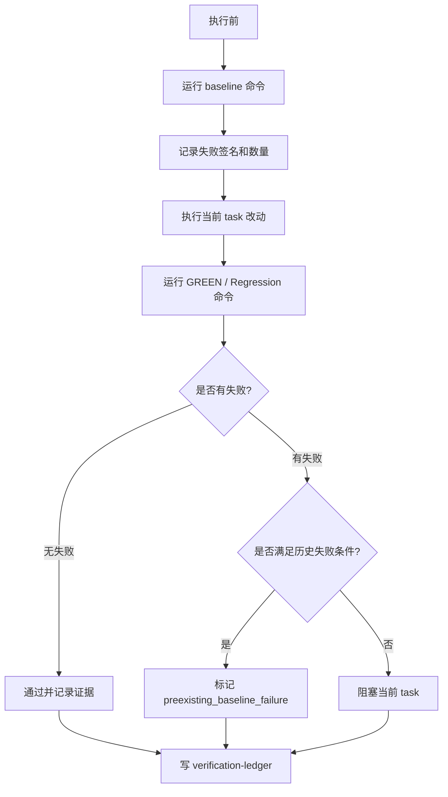
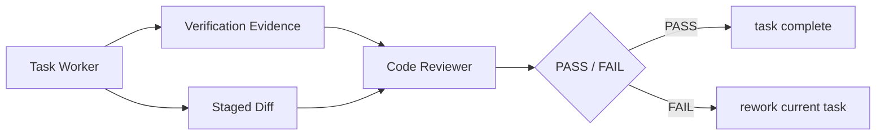

# 验证治理：AI 说“测试失败无关”是不够的

AI Coding 进入团队交付后，最敏感的问题之一是验证。模型很容易说：“这个测试失败看起来是历史问题”“这个失败应该和本次改动无关”“建议你本地再验证一下”。这些话在个人使用时也许可以接受，但在团队交付里不够。负责人需要看到证据：改前是什么状态，改后是什么状态，失败签名是否一致，失败是否进入本次改动文件，新增行为是否有通过证据。

验证治理的目标，是把“模型判断”变成“证据链判断”。如果无法证明失败是历史问题，就应该默认阻塞当前 task，而不是靠口头解释继续推进。

> 一句话结论：**AI 说测试失败无关不算证据，改前 baseline 和改后 ledger 才算证据。**

### 常见误区

| 误区 | 表现 | 后果 |
|---|---|---|
| 只跑改后测试 | 不知道失败是否原本存在 | 无法区分历史失败和本次回归 |
| 失败靠自然语言解释 | “应该无关”“看起来是环境问题” | 质量判断不可审计 |
| 只看命令 exit code | 不记录失败签名、数量、栈 | 下次无法比较 |
| 新增测试失败也标历史问题 | 只要老测试也失败就放过 | 新行为没有被验证 |
| 验证结果留在聊天里 | 后续 summary 和 review 找不到证据 | 交付链路断裂 |

验证治理要解决的是：每个 task 的质量判断都要能被复查。

## 一、为什么 baseline 不是“多跑一次测试”

很多团队觉得改前跑 baseline 很浪费时间。实际上，baseline 解决的是责任归因问题：没有改前状态，就无法判断改后失败是不是本次引入。

| 没有 baseline 时 | 有 baseline 时 |
|---|---|
| 只能说“看起来无关” | 可以比较失败签名和数量 |
| 历史失败和新增失败混在一起 | 可以分类为 preexisting 或 new |
| reviewer 只能凭经验判断 | reviewer 可以看证据 |
| summary 只能写“测试有失败” | summary 可以写清失败是否阻塞 |

baseline 不是为了追求每次都全量测试，而是为了让失败判断有证据。实际执行时可以先跑当前 task 相关命令，不一定每次都跑全仓。

### 设计原则

第一，**改前先跑 baseline**。没有改前状态，就没有资格判断改后失败是否历史存在。

第二，**失败分类要有硬条件**。只有满足签名一致、数量未增加、失败栈不进入改动文件、新增行为有通过证据等条件，才可以标记为历史失败。

第三，**证据必须落盘**。命令、时间、结果、失败分类、阻塞判断都要进入 ledger，而不是只留在聊天里。

## 二、案例拆解：baseline-aware verification

这套框架对每个 task 要求 baseline-aware verification。流程如下：



关键条件可以写成表格：

| 条件 | 含义 |
|---|---|
| 改前已失败 | baseline 中已经存在同类失败 |
| same signature | 改后失败签名和改前一致 |
| 失败数量未增加 | 没有出现更多失败用例 |
| 失败不是新增测试 | 新增行为的测试不能被标成历史失败 |
| 栈不进入 changed files | 失败栈没有指向本次改动文件 |
| 新增行为有通过证据 | 本次需求新增行为已经有正向通过测试 |

只要有一个关键条件不满足，就应该阻塞当前 task。

### 失败分类建议

团队可以先约定几类最小失败分类。

| 分类 | 含义 | 是否阻塞 |
|---|---|---|
| `passed` | 命令通过 | 否 |
| `preexisting_baseline_failure` | 改前已失败，改后签名和数量不变，且不影响当前行为 | 否，但要记录 warning |
| `new_failure` | 改前通过，改后失败 | 是 |
| `increased_failure` | 改前失败，改后失败数量增加 | 是 |
| `changed_files_stack_hit` | 失败栈进入本次改动文件 | 是 |
| `new_test_failed` | 新增或修改测试失败 | 是 |
| `uncertain_failure` | 证据不足以判断 | 是 |

最重要的一条规则是：**不确定默认阻塞**。团队可以接受历史失败不阻塞，但不能接受无法分类的失败被放过。

## 三、Verification Ledger 长什么样

验证证据进入 `evidence/verification-ledger.jsonl`。JSONL 的好处是可以追加，适合记录多个 task、多个命令和多次重试。

```text
.team-agent/tasks/{taskId}/evidence/
└── verification-ledger.jsonl
```

一条简化记录可以是：

```json
{
  "taskId": "T1",
  "phase": "develop_feature",
  "command": "mvn test -Dtest=PrizeTypeServiceTest",
  "stage": "green",
  "status": "failed",
  "exitCode": 1,
  "failureSignature": "PrizeTypeServiceTest.shouldKeepLegacyType",
  "baselineSignature": "PrizeTypeServiceTest.shouldKeepLegacyType",
  "failureCountBefore": 1,
  "failureCountAfter": 1,
  "changedFiles": [
    "src/main/java/com/example/prize/PrizeTypeService.java"
  ],
  "classification": "preexisting_baseline_failure",
  "blocksCurrentTask": false,
  "positiveEvidence": [
    "PrizeTypeServiceTest.shouldCreateNewPrizeType passed"
  ]
}
```

如果失败无法分类，就应该记录为阻塞：

```json
{
  "taskId": "T2",
  "command": "mvn test -Dtest=PrizeQueryTest",
  "stage": "regression",
  "status": "failed",
  "classification": "new_or_uncertain_failure",
  "blocksCurrentTask": true,
  "reason": "失败栈进入本次改动文件，且 baseline 中不存在相同签名"
}
```

ledger 的价值不是替代 CI，而是让 AI Coding 任务本身有本地验证证据。

### Ledger 里最少要记录什么

最小 ledger 不需要一开始很复杂，但以下字段建议保留。

| 字段 | 作用 |
|---|---|
| `taskId` | 关联当前 plan task |
| `command` | 复现验证动作 |
| `stage` | 区分 baseline、green、regression |
| `status` | 命令通过或失败 |
| `failureSignature` | 用于和 baseline 比较 |
| `changedFiles` | 判断失败是否进入改动范围 |
| `classification` | 失败分类 |
| `blocksCurrentTask` | 是否阻塞当前 task |
| `positiveEvidence` | 新增行为是否有通过证据 |

只写“测试通过”四个字没有审计价值。能复现的命令、能比较的失败签名、能解释的阻塞判断，才是团队需要的证据。

## 四、验证和 Review 的关系

验证不是 worker 自己说了算。worker 返回验证证据后，控制平面再把 staged diff 交给 code reviewer。



Reviewer 要检查两件事：

- diff 是否满足 task contract。
- 验证证据是否足够支撑当前 task 完成。

如果新增行为没有正向通过证据，即使回归测试没有失败，也不应该轻易通过。

### 哪些情况不能让 AI 解释放过

下面几种情况应该默认阻塞，除非有非常明确的人为豁免。

| 情况 | 原因 |
|---|---|
| 新增测试失败 | 说明新行为没有被证明 |
| 改前通过、改后失败 | 高概率是本次回归 |
| 失败数量增加 | 历史问题恶化 |
| 失败栈进入 changed files | 和本次改动高度相关 |
| 验证命令不存在或跑错模块 | 计划 contract 不成立 |
| 没有正向通过证据 | 无法证明需求完成 |
| 分类为 uncertain | 证据不足 |

AI 可以辅助分析失败，但不能替代团队的阻塞规则。

## 五、团队参考做法

其他团队可以先做一个最小 verification ledger：

```json
{
  "taskId": "T1",
  "command": "npm test -- user-service",
  "stage": "baseline|green|regression",
  "status": "passed|failed",
  "failureSignature": "optional",
  "classification": "passed|new_failure|preexisting_failure|uncertain_failure",
  "blocksCurrentTask": true
}
```

第一阶段要求：

1. 每个 task 改前先跑 baseline。
2. 改后至少跑 GREEN 和 Regression。
3. 失败必须分类。
4. 不确定失败默认阻塞。
5. ledger 必须进入 summary 和 review 输入。

第二阶段再增强失败签名、changed files 栈分析、CI 结果关联和趋势统计。

## 六、检查清单

- 每个 task 是否有改前 baseline？
- 改后失败是否能和 baseline 比较？
- 是否记录失败签名和失败数量？
- 新增测试失败是否默认阻塞？
- 失败栈进入 changed files 时是否阻塞？
- 新增行为是否有正向通过证据？
- 验证记录是否进入 ledger？
- summary 是否引用验证证据，而不是只写“测试通过/失败”？

## 七、思考与实践

1. 你们团队遇到测试失败时，怎么判断是历史失败还是本次回归？
2. 如果要求每个 task 改前都跑 baseline，你们最大的阻力是耗时、环境不稳定，还是测试命令不清楚？
3. 哪类失败在你们团队里应该默认阻塞，而不能让 AI 口头解释放过？

## 八、结尾

团队 AI Coding 不能依赖“看起来无关”的判断。验证治理的核心是证据链：改前状态、改后状态、失败分类、阻塞判断和正向通过证据。只有验证证据可审计，团队才敢把 AI Coding 纳入真实交付流程。

下一篇进入资产沉淀：如何让每次 AI 交付反哺下一次任务，而不是让经验继续留在聊天记录里。
