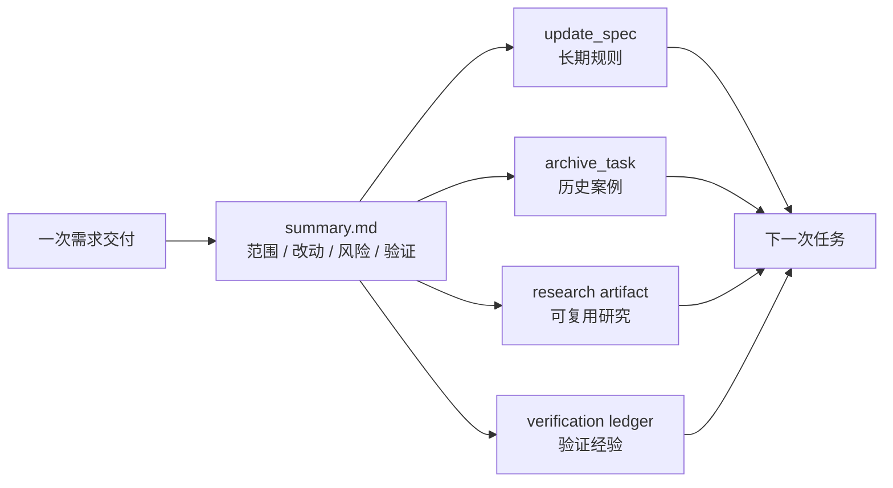

# 资产沉淀：让每次交付反哺下一次任务

很多 Agent 建设会卡在一个问题上：内容越来越多，但越来越不可信。Prompt 写了一版又一版，Skill 补了一堆，Wiki 也有不少规范，但真实业务规则、历史踩坑、代码约束和验证经验仍然靠人记。过一段时间，Agent 看起来更复杂了，实际知识却过期了。

团队级 AI Coding 不能只靠人工定期维护 Prompt。更可持续的方式，是把资产沉淀嵌入每次交付：需求做完后，哪些规则值得沉淀，哪些案例值得归档，哪些研究结论后续还会复用，哪些验证经验应该保留，都要成为交付终态的一部分。

资产沉淀飞轮的目标，是让每次交付都反哺下一次任务。

> 一句话结论：**Agent 内容不能只靠人工维护，真实交付才是最好的知识更新来源。**

### 常见误区

| 误区 | 表现 | 后果 |
|---|---|---|
| 代码合了就结束 | 没有 summary、没有规则处置 | 经验留在人脑和 PR 里 |
| 定期人工整理 Prompt | 依赖负责人记得维护 | 容易漏，且无法覆盖真实变化 |
| 历史案例留在聊天里 | 下次任务无法自动召回 | 相似问题反复解释 |
| 研究结论不落盘 | 中间件、框架、调用链分析只在对话中 | 后续计划和开发无法复用 |
| 所有经验都写进规则 | 临时事实变成长期约束 | SPEC 膨胀且误导后续任务 |

资产沉淀的关键，是区分哪些是长期规则，哪些是历史案例，哪些只是本次任务事实。

## 一、资产沉淀不是“把东西都保存”

很多团队的知识库越来越乱，是因为只做保存，不做分层。一次交付结束后，至少要把信息分成四类。

| 信息类型 | 应该去哪里 | 后续怎么用 |
|---|---|---|
| 长期规则 | SPEC | 后续任务按语义注入 |
| 一次交付案例 | archive index + summary | 相似任务弱召回 |
| 探索性研究 | research artifact | 后续阶段或类似任务按范围复用 |
| 验证经验 | verification ledger + summary | review、复盘和失败分类参考 |

如果所有东西都写进 Prompt 或 Wiki，最后会变成没人敢删、Agent 也不知道怎么读的“知识堆”。

### 设计原则

第一，**沉淀动作进入主流程**。总结、规则处置和归档不能依赖人想起来，而要成为交付终态。

第二，**规则、案例、研究、验证分层保存**。不同资产有不同 owner、生命周期和复用方式。

第三，**历史召回是弱引用**。历史案例可以提示相似风险，但不能覆盖当前 PRD、当前 SPEC 和当前设计事实。

## 二、案例拆解：交付尾链

完整需求流在开发完成后不应该直接结束，而是进入：

```text
summarize_delivery -> update_spec -> archive_task
```

这条尾链对应的资产如下：

```text
.team-agent/tasks/{taskId}/
├── summary.md
├── evidence/verification-ledger.jsonl
├── research/
│   ├── explore/
│   └── middleware/
└── context/archive-recall.json

.team-agent/spec/
├── team/
└── app/

.team-agent/tasks/archive/
├── index.jsonl
└── route-index.json
```

沉淀飞轮可以这样理解：



### Summary 写什么

`summary.md` 不是流水账，它要把一次交付压缩成后续可消费的事实。

```md
# 交付总结

## 交付范围

- 新增权益类型识别和配置生成。
- 补充查询展示回归。

## 主要改动

| Area | Files | Reason |
|---|---|---|
| 领域逻辑 | PrizeTypeService | 新增权益类型识别 |
| 测试 | PrizeTypeServiceTest | 覆盖新增类型和存量类型 |

## 验证证据

- `mvn test -Dtest=PrizeTypeServiceTest` passed
- verification ledger: `evidence/verification-ledger.jsonl`

## 风险和后续关注

- 存量权益类型兼容仍需在集成环境观察。

## 可沉淀规则

- 新增权益类型必须覆盖创建、查询、展示路径。
```

summary 是 update_spec 和 archive_task 的输入。写得越清楚，后续沉淀越稳定。

### Summary 不应该写成流水账

一份好的 summary 要面向未来任务，而不是复述本次聊天过程。

| 不推荐 | 推荐 |
|---|---|
| “完成了相关代码修改” | “完成新增权益类型识别和查询展示兼容，涉及 X/Y 模块” |
| “测试有一个失败，应该无关” | “回归命令失败签名与 baseline 一致，分类为 preexisting_baseline_failure” |
| “后续注意兼容” | “存量权益类型展示路径需要在类似需求中固定回归” |
| “无需更新规则”但不说明原因 | “本次只调整一次性配置，不形成可复用规则” |

summary 写得越像未来任务的索引，资产飞轮越容易转起来。

## 三、哪些内容进 SPEC

只有可复用规则才进入 SPEC。判断标准是：下一次类似需求是否应该让 Agent 自动看到这条规则。

| 内容 | 是否进 SPEC | 原因 |
|---|---|---|
| “新增权益类型必须覆盖创建、查询、展示路径” | 是 | 可复用业务开发规则 |
| “本次需求 ID 是 123456” | 否 | 只属于当前任务 |
| “这次测试环境数据库不可用” | 否 | 临时环境事实 |
| “配置变更必须补充灰度开关” | 是 | 可复用工程约束 |
| “某个历史 bug 的修复路径” | 不一定 | 更适合作为 archive case，除非抽象成规则 |

`update_spec` 阶段应该允许三种结果：

1. 更新已有 SPEC。
2. 推荐新增 focused Spec。
3. 明确本次无需更新 SPEC。

第三种也很重要。不是每个需求都应该产生新规则，否则 SPEC 会膨胀。

### Spec disposition 要成为交付动作

交付结束时，建议明确记录一次规则处置结果。

```json
{
  "taskId": "123456",
  "specDisposition": {
    "decision": "update_existing_spec",
    "target": ".team-agent/spec/app/business/prize-type.md",
    "reason": "新增权益类型需要固定创建、查询、展示回归要求"
  }
}
```

如果无需更新，也要写清楚：

```json
{
  "decision": "no_update_required",
  "reason": "本次只修正文案，不产生可复用业务或工程规则"
}
```

这能防止“规则维护”变成一句空话。

## 四、Archive 如何被召回

归档不是把任务目录挪走这么简单，而是要形成可检索的历史案例索引。

简化的 archive index entry：

```json
{
  "taskId": "123456",
  "title": "新增奖品权益类型",
  "domain": ["奖品", "权益类型"],
  "changedAreas": ["PrizeTypeService", "PrizeConfig"],
  "middleware": [],
  "risks": ["存量类型兼容"],
  "summaryPath": ".team-agent/tasks/archive/123456/summary.md"
}
```

下一次任务进入设计或计划前，可以根据当前 PRD、selected slices、SPEC 和 code refs 召回少量历史案例，生成：

```text
.team-agent/tasks/{taskId}/context/archive-recall.json
```

历史召回要遵守几个边界：

- fail-open：召回失败不阻塞主流程。
- budgeted：只召回少量最相关案例。
- weak reference：历史案例只能作为参考，不能覆盖当前需求事实。
- 不写回 `task.json`：召回结果是上下文，不是任务状态。

一个好的 archive card 不需要很长，但要足够可检索：

```json
{
  "caseId": "case-20260501-prize-type",
  "title": "新增权益类型支持",
  "domains": ["奖品", "权益类型"],
  "changedAreas": ["配置解析", "查询展示", "回归验证"],
  "riskSignals": ["存量兼容", "枚举映射"],
  "useWhen": ["新增或调整权益类型", "查询展示兼容需求"],
  "doNotUseWhen": ["仅修改文案", "不涉及权益类型识别"],
  "summaryPath": ".team-agent/tasks/archive/123456/summary.md"
}
```

`useWhen` 和 `doNotUseWhen` 很重要。没有适用边界的历史案例，容易误导后续任务。

### Research Artifact 的位置

复杂需求经常需要额外研究，例如中间件接入、调用链梳理、框架约束、历史实现比较。研究结果如果只留在聊天里，后续 phase 和后续任务都无法复用。

这套框架把研究结果放到：

```text
.team-agent/tasks/{taskId}/research/
├── explore/
└── middleware/
```

研究 artifact 应该包含：

- 研究问题。
- 结论摘要。
- 引用文件和路径。
- 适用范围。
- 失效条件。

当需求范围或设计方案变化时，要判断研究结论是否仍然可复用；不能默认沿用旧研究。

### 资产也会失效

沉淀不是永久可信。规则、案例和研究结论都需要失效条件。

| 资产 | 常见失效原因 | 应对 |
|---|---|---|
| SPEC 规则 | 业务流程变化、技术栈升级 | 更新 Source Reference 和规则正文 |
| Archive case | 当前需求边界不同 | 作为弱参考，不直接套用 |
| Research artifact | 依赖版本变化、方案变更 | 标记不可复用或重新研究 |
| Verification evidence | 测试命令变化、环境变化 | 只作为历史证据，不替代当前验证 |

团队越依赖资产复用，越要明确资产的适用范围和失效条件。

## 五、团队参考做法

其他团队可以先建立四类资产：

```text
.team-agent/
├── spec/
├── tasks/{taskId}/summary.md
├── tasks/{taskId}/research/
├── tasks/{taskId}/evidence/verification-ledger.jsonl
└── archive/index.jsonl
```

交付结束时固定问四个问题：

1. 这次交付有没有可复用规则？如果有，更新 SPEC。
2. 这次交付有没有可参考案例？如果有，写 archive index。
3. 这次交付有没有可复用研究？如果有，落 research artifact。
4. 这次验证有没有历史失败或特殊证据？如果有，进入 ledger 和 summary。

先做人工确认版沉淀，再逐步让 Agent 推荐更新内容。不要一开始就让模型自动改所有规则。

## 六、检查清单

- 交付完成后是否一定生成 summary？
- summary 是否包含范围、改动、验证、风险和可沉淀规则？
- SPEC 更新是否有明确入口？
- 是否允许“本次无需更新 SPEC”？
- 历史案例是否有 index，而不是只存完整目录？
- archive recall 是否按预算召回？
- research artifact 是否落盘？
- 资产是否区分长期规则、历史案例、临时事实？

## 七、思考与实践

1. 你们最近一次 AI Coding 的经验，后来进入了哪里？SPEC、Wiki、PR 评论，还是只留在聊天里？
2. 哪些内容应该沉淀成长期规则，哪些只适合放进历史案例？
3. 如果每次交付结束都固定做一次资产处置，你们团队会担心流程变重，还是担心规则质量不好？

## 八、结尾

Agent 内容不能只靠人工维护。团队要让每次真实交付都成为知识更新来源：规则进 SPEC，案例进 archive，研究进 artifact，验证进 ledger。这样 AI Coding 才会越用越贴近团队，而不是越用越依赖某几个人的经验。

下一篇进入 Agent 分层：为什么不要让一个万能 Agent 同时负责调度、设计、开发、验证和评审。
