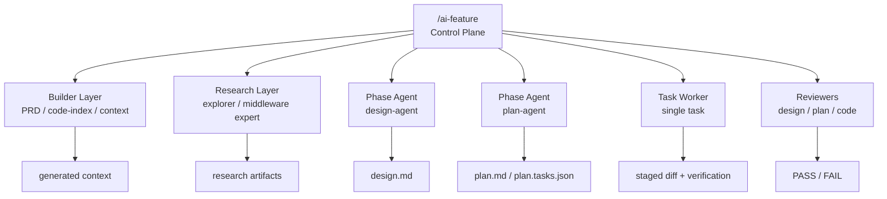

# Agent 分层：不要让一个万能 Agent 包办所有事

团队做 AI Coding Agent 时，很容易从“一个超级 Agent”开始：它读需求、查代码、写设计、拆计划、改代码、跑测试、评审自己、总结归档。这个方案看起来简单，但真实运行时很快会失控。一个 Agent 既当调度者又当执行者，还要自我评审，职责混在一起后，问题很难定位：到底是上下文不够、计划不清、执行跑偏，还是评审没拦住？

团队级 Agent 架构需要分层。控制平面负责流程推进，builder 负责上下文构建，research 负责补充研究，phase agent 负责阶段产物，worker 负责单个 task，reviewer 负责审查。每一层只做自己的事，才能让系统可恢复、可验证、可演进。

> 一句话结论：**一个万能 Agent 看起来简单，真正稳定的是分层职责和清晰边界。**

### 常见误区

| 误区 | 表现 | 后果 |
|---|---|---|
| 一个 Agent 包办所有事 | 需求、设计、开发、验证、评审全在一个 Prompt | 失败原因难定位 |
| leaf agent 调 subagent | 执行单元又开始调度其他执行单元 | 控制权分散，状态不可控 |
| builder 推进流程 | 上下文生成工具顺手改任务状态 | 派生产物和真相源混淆 |
| reviewer 自己修代码 | 审查者同时修改代码 | 评审边界失效 |
| research 留在对话里 | 探索结果不落盘 | 后续阶段无法复用 |

分层不是为了复杂，而是为了让每个失败点都能被定位和修复。

## 一、什么时候必须分层

不是所有团队第一天就需要一堆 Agent。可以用下面几个信号判断是否必须拆职责。

| 信号 | 说明 |
|---|---|
| 一个 Agent 经常边写边改计划 | 计划和执行混在一起 |
| 测试失败后 Agent 自己解释并继续提交 | 执行和质量判断混在一起 |
| 设计方案缺证据但 Agent 自己全仓搜索 | 设计和上下文构建混在一起 |
| review 只是 Agent 自我总结 | 审查边界失效 |
| 任务卡住后无法恢复 | 控制面和执行面混在一起 |

只要出现两三个信号，就说明“万能 Agent”已经不适合团队交付。

### 设计原则

第一，**控制和执行分离**。控制平面决定流程推进和调度，leaf agent 只完成被分配的阶段或 task。

第二，**构建和消费分离**。builder 生成上下文，phase agent 消费上下文，不要让 phase agent 临场重建运行时产物。

第三，**执行和评审分离**。worker 负责改代码和验证，reviewer 负责审查 diff 和证据。

## 二、案例拆解：职责分层

这套框架的职责分层可以概括为：



几类角色的边界如下：

| 层级 | 负责 | 不负责 |
|---|---|---|
| Control Plane | phase 推进、task 调度、用户确认、状态变更 | 直接写业务代码 |
| Builder Layer | PRD 构建、代码索引、上下文重建 | 推进 phase、做设计决策 |
| Research Layer | 仓库探索、中间件研究、结论落盘 | 修改任务状态、直接实现需求 |
| Designer | 写 `design.md` | 拆执行 task、改代码 |
| Planner | 写 `plan.md` 和 `plan.tasks.json` | 现场写代码 |
| Task Worker | 执行单个 task、产出验证证据 | 提交代码、推进 phase、调 subagent |
| Reviewer | 审查 design、plan 或 staged diff | 自评审、自修复 |

这套分工让系统出现问题时能回到明确 owner：设计问题回到 designer，计划问题回到 planner，执行问题回到 worker，上下文缺失回到 builder 或 research。

### 控制面最小职责

控制面不需要很复杂，但要掌握几件不能下放的事情：

| 职责 | 为什么不能下放给 worker |
|---|---|
| 读取和更新任务状态 | 状态真相源只能有一个 owner |
| 决定进入哪个阶段 | 避免执行单元越级推进 |
| 处理用户确认和阻塞 | 用户决策要回到主流程 |
| 调度 research 和 reviewer | 防止 leaf agent 自己找证据、自我放行 |
| 暂存和提交当前 task diff | 控制提交范围，避免混入无关改动 |

如果 worker 既能改代码又能推进阶段又能提交，后续一旦出问题，很难知道是计划错、执行错还是评审漏。

## 三、Leaf Agent 为什么不能调度

Leaf agent 指的是被控制平面分配具体任务的执行单元。它应该 path-first 工作：只接收路径、ID、短摘要、allowed paths、验证命令和 research artifact paths。

一个 worker handoff 可以是：

```json
{
  "taskId": "T1",
  "planPath": ".team-agent/tasks/123456/plan.tasks.json",
  "prdContextPath": ".team-agent/tasks/123456/generated/context/prd.jsonl",
  "codeContextPath": ".team-agent/tasks/123456/generated/context/code.jsonl",
  "allowedPaths": [
    "src/main/java/com/example/prize/",
    "src/test/java/com/example/prize/"
  ],
  "verificationCommands": [
    "mvn test -Dtest=PrizeTypeServiceTest"
  ]
}
```

worker 如果发现证据不足，不应该自己调 explorer 或改计划，而应该返回结构化诊断：

```json
{
  "status": "input_contract_unsatisfied",
  "taskId": "T1",
  "diagnostics": {
    "missingEvidence": [
      "缺少 PrizeConfig 写入路径的 code ref",
      "缺少权益类型配置来源说明"
    ]
  }
}
```

控制平面再决定是重建上下文、调用 research、回到计划，还是进入变更流程。

### `input_contract_unsatisfied` 是好事

很多团队会把 Agent 返回“证据不足”看成失败。其实这恰恰是系统稳定的表现。它说明执行单元没有硬猜，也没有越权扩范围。

常见的证据不足可以这样路由：

| 缺什么 | 回到哪里 |
|---|---|
| PRD 或上下文派生产物缺失 | context builder / sync-context |
| 代码调用链或测试入口缺失 | research / explorer |
| 中间件规则或接入约束缺失 | 专项研究或已有规则 |
| 验证命令不存在 | plan_delivery |
| 业务事实未确认 | 用户确认 / 设计前事实 |

分层之后，Agent 不需要装作什么都知道。它只需要把缺口说清楚。

### Research Layer 如何落盘

研究层的输出不能只留在对话里。这套框架把研究结论落到：

```text
.team-agent/tasks/{taskId}/research/
├── explore/
│   └── {research-id}.md
└── middleware/
    └── {research-id}.md
```

研究产物应该包含：

- 研究问题。
- 结论摘要。
- 代码引用。
- 风险和适用范围。
- 后续阶段如何使用。

这样 planner 和 worker 可以通过路径消费研究结论，而不是依赖某次聊天上下文。

## 四、团队参考做法

其他团队可以先定义最小角色矩阵：

| 角色 | 最小职责 |
|---|---|
| Orchestrator | 维护任务状态、推进阶段、分配 task |
| Context Builder | 生成 PRD/code/rule working set |
| Designer | 输出技术设计 |
| Planner | 输出计划和 tasks |
| Worker | 执行单个 task |
| Reviewer | 审查产物和 diff |
| Summarizer | 总结和沉淀建议 |

第一阶段不要把每个角色都做成独立 Agent，可以先用命令、脚本和人工确认组合实现。关键是职责边界先稳定。

### 不是所有角色都要一开始产品化

一个实用落地顺序是：

1. 先拆 reviewer：让审查者和执行者分开。
2. 再拆 planner：让计划先形成 task contract。
3. 再拆 context builder：让上下文选择可见、可重建。
4. 最后拆 research：把复杂探索结论沉淀成 artifact。

这样不会一上来制造很多角色，但能逐步把最危险的职责混杂点拆开。

## 五、检查清单

- 是否存在一个 Agent 同时设计、开发、验证、评审？
- 控制平面是否是唯一推进状态的角色？
- builder 是否只生成上下文，不推进 phase？
- worker 是否一次只执行一个 task？
- reviewer 是否只审查不修改？
- research 结论是否落盘？
- leaf agent 证据不足时是否返回诊断，而不是自行扩展范围？
- 失败时能否定位到具体层级？

## 六、思考与实践

1. 你们现在的 Agent 更像万能助手，还是已经区分设计、计划、开发、评审职责？
2. 哪些职责绝对不应该让同一个 Agent 同时承担？
3. 如果只能先拆一个角色，你会优先拆 reviewer、planner，还是 context builder？

## 七、结尾

Agent 分层的意义不是增加角色数量，而是让团队 AI Coding 有清晰责任边界。一个万能 Agent 看起来简单，实际会把调度、执行、评审和状态混在一起。分层之后，每个环节都能被审查、替换和优化。

下一篇进入多工具适配：如果明天换 AI Coding 工具，团队的规则、任务状态和历史产物还能不能保留。
