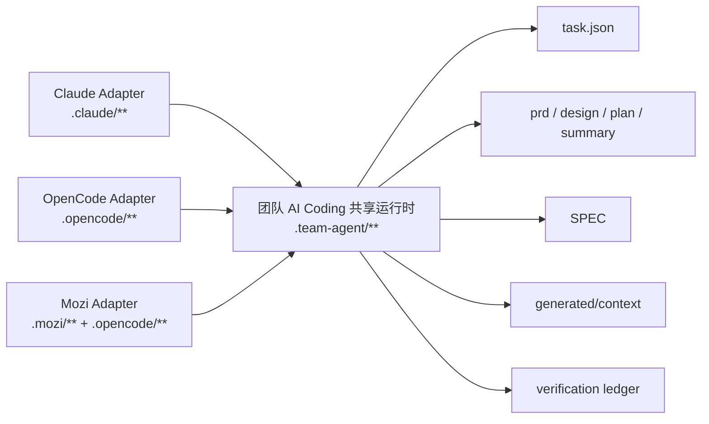

# 多工具适配：把共享语义放 Runtime，把工具差异放 Adapter

AI Coding 工具变化很快。今天团队可能主要用 Claude，明天有人想用 OpenCode，后天又要接入公司内部 IDE 插件。如果每接一个工具都重建一套 Agent、Prompt、任务状态和规则体系，团队会再次回到重复建设。

多工具适配的关键，是把共享语义放在 runtime，把工具差异放在 adapter。Runtime 承接任务状态、阶段产物、规则、上下文和验证证据；adapter 负责把某个具体工具的命令、hook、上下文注入和 UI 入口接到这套 runtime 上。

> 一句话结论：**工具可以换，任务状态、规则和交付语义不能跟着重建。**

### 常见误区

| 误区 | 表现 | 后果 |
|---|---|---|
| 每个工具一套流程 | Claude 一套，OpenCode 一套，IDE 插件一套 | 产物和状态不能共享 |
| 工具 Prompt 承接业务规则 | 换工具就要迁移规则 | 规则重复维护 |
| adapter 修改任务状态语义 | 不同工具对完成、失败、暂停理解不同 | 恢复和归档混乱 |
| 只做 CLI，不考虑 hook/context | 命令能跑，但上下文注入不一致 | Agent 行为不稳定 |
| 追求所有工具能力完全一致 | 为少数工具特性污染公共 runtime | 核心语义变复杂 |

适配不是把所有工具拉平，而是让不同工具共享同一套交付语义。

## 一、多工具适配真正要保住什么

工具可以换，但下面这些东西不能跟着换。

| 必须保住 | 原因 |
|---|---|
| 任务状态 | 换工具后还要知道任务走到哪里 |
| 稳定产物 | PRD、设计、计划、总结要能继续审查 |
| 规则体系 | 团队规则不能复制到多个工具 Prompt |
| 上下文产物 | working set 要能被不同工具读取 |
| 验证证据 | 质量判断不能随工具丢失 |
| 历史归档 | 相似任务经验要跨工具复用 |

如果一个工具接入后，必须复制一份规则、重建一套任务状态，说明适配层越界了。

### 设计原则

第一，**共享状态只在 runtime**。adapter 不定义新的任务状态真相源。

第二，**共享规则只在 SPEC**。adapter Prompt 只承接工具和运行时契约，不重复维护业务规则。

第三，**工具差异留在边缘**。命令格式、插件结构、hook 机制、UI 入口都属于 adapter，不应污染核心流程。

## 二、案例拆解：Runtime 和 Adapter 的关系

多工具适配可以简化成：



目录上大致是：

```text
src/
├── templates/runtime/
│   ├── tools/
│   ├── spec/
│   └── workflow/
└── adapters/
    ├── claude/
    ├── opencode/
    ├── mozi/
    └── codex/
```

`runtime/templates/**` 是共享 runtime 模板；`src/adapters/**` 是不同工具的生成模板和提示适配。业务项目初始化后，公共状态仍然落在 `.team-agent/**`。

### Adapter 应该负责什么

Adapter 的职责可以归纳为四类：

| 职责 | 示例 |
|---|---|
| 命令暴露 | 把 `/ai-feature`、`/ai-quick` 等入口映射到工具支持的命令形态 |
| Agent/Skill 模板 | 生成当前工具可识别的 agent、skill、prompt 配置 |
| Hook/Context 注入 | 在会话或 subagent 启动时注入任务摘要、Spec、working set 路径 |
| 本地配置 | 生成工具需要的配置文件和本地 runtime 配置 |

Adapter 不应该负责：

- 定义新的任务状态。
- 改写 workflow 主干。
- 重复维护团队规范。
- 把工具专属能力变成核心 runtime 强依赖。

一个 adapter 生成结构可以类似：

```text
.claude/
├── agents/
├── commands/
├── skills/
└── settings.local.json

.opencode/
├── agents/
├── commands/
└── plugin/

.team-agent/
├── tasks/
├── spec/
├── tools/
└── workflow/
```

工具目录可以不同，但 `.team-agent/**` 仍是共享状态和产物位置。

## 三、Runtime 和 Adapter 的边界测试

接入新工具时，可以用三个问题做边界测试：

1. 删除这个工具的私有目录后，任务状态和历史产物是否还在？
2. 新工具是否只需要读取 `.team-agent/**` 就能恢复任务？
3. 团队规则是否没有复制到新工具的 Prompt 里？

如果答案是否，说明共享语义没有真正放到 runtime。

一个简化的 adapter manifest 可以这样表达：

```json
{
  "adapter": "opencode",
  "runtimeRoot": ".team-agent",
  "commands": [
    { "name": "ai-feature", "runtimeCommand": "/ai-feature <taskId>" },
    { "name": "ai-quick", "runtimeCommand": "/ai-quick <taskId>" }
  ],
  "generatedPaths": [
    ".opencode/agents/",
    ".opencode/commands/",
    ".opencode/plugin/"
  ],
  "sharedState": [
    ".team-agent/.current-task",
    ".team-agent/tasks/{taskId}/task.json",
    ".team-agent/spec/",
    ".team-agent/tasks/{taskId}/generated/context/"
  ]
}
```

这里的重点是 manifest 显式声明：adapter 暴露哪些入口、生成哪些工具私有文件、读取哪些共享 runtime 路径。它不定义新的任务状态。

### Adapter 需要有生成清单

多工具接入最怕“生成了哪些文件没人知道”。建议每个 adapter 都维护 manifest 或生成清单。

| 字段 | 作用 |
|---|---|
| `adapter` | 工具名称 |
| `generatedPaths` | 本 adapter 生成哪些私有文件 |
| `sharedRuntimeRoot` | 共享运行时根目录 |
| `commands` | 暴露哪些命令 |
| `contextHooks` | 什么时候注入任务摘要和规则 |
| `doctorChecks` | 初始化后检查哪些文件 |

这样后续升级 adapter 时，团队能判断是工具私有变更，还是影响了共享 runtime。

### 为什么 Prompt 不承接共享知识

多工具适配时，最容易犯的错误是把共享知识复制到每个工具 Prompt 里。这样一来，每次规则变化都要同步多个 adapter，迟早会不一致。

更稳的方式是：

| 内容 | 放哪里 |
|---|---|
| 工具如何调用命令 | adapter prompt |
| Agent 输出 JSON schema | adapter prompt |
| 阶段交付流程 | runtime workflow + adapter prompt |
| Java 实现规范 | SPEC |
| 应用业务规则 | App SPEC |
| 历史案例 | archive |
| 当前任务上下文 | generated context |

也就是说，adapter 只解释“这个工具如何接入流程”，不承接长期业务知识。

### Tool lock-in 的早期信号

下面这些信号说明团队已经被某个工具绑住了：

| 信号 | 问题 |
|---|---|
| 任务状态只存在该工具会话里 | 无法跨工具恢复 |
| 规则写在该工具专属 Prompt 中 | 换工具要迁移知识 |
| 历史案例只能从聊天记录搜索 | 归档资产不可复用 |
| 验证证据没有落地文件 | 审查依赖工具界面 |
| adapter 里有大量业务规则 | 工具层污染业务知识 |

越早把这些内容移到 runtime，后续越容易接入新工具。

## 四、团队参考做法

其他团队可以先定义三层：

```text
runtime/
├── tasks/
├── spec/
├── context/
└── tools/

adapters/
├── cli/
├── ide-plugin/
└── web-runner/
```

第一阶段只需要支持一个工具，但也要提前把边界分清：

1. 任务状态写 runtime，不写工具私有目录。
2. 规则写 spec，不写工具 Prompt。
3. 工具 Prompt 只引用路径，不粘贴完整产物。
4. 换工具时，旧任务目录仍能被新工具读取。

第二阶段再增加更多 adapter。每增加一个 adapter，都检查它是否复用了 runtime，而不是复制 runtime。

## 五、检查清单

- 不同 AI 工具是否共享同一个任务目录？
- adapter 是否只负责工具接入？
- 规则是否只维护在 SPEC 中？
- Prompt 是否重复了大量业务规则？
- 工具切换后，旧任务是否能继续？
- hook/context 注入是否读取 runtime 产物？
- adapter 是否引入了核心 runtime 不需要的依赖？
- 新工具接入是否需要改 workflow 主干？

## 六、思考与实践

1. 如果你们团队明天从一个 AI Coding 工具切到另一个工具，历史任务和规则还能继续用吗？
2. 你们现在的 Prompt 里有多少内容其实属于共享规则，而不是工具适配？
3. 新接一个工具时，你们更担心命令适配、上下文注入，还是任务状态不一致？

## 七、结尾

多工具适配的目标不是让所有工具长得一样，而是让团队交付语义保持一致。共享状态、规则、上下文和证据放 runtime；命令、hook、插件和 UI 差异放 adapter。这样团队不会被单一工具绑定，也不会因为接入新工具重复建设 Agent。

下一篇进入协作面：当 AI 产出 design、plan、diff 和 evidence 后，团队应该如何审查、接管和治理这些产物。
