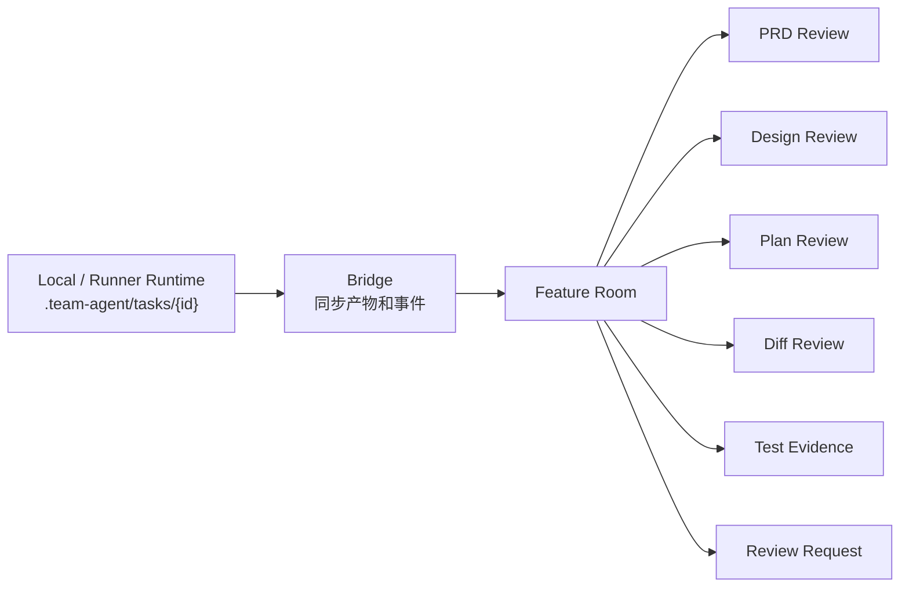
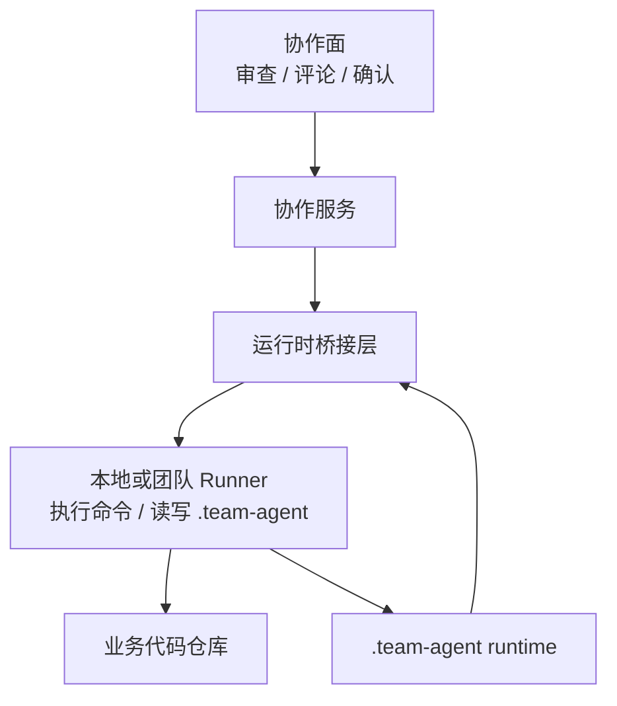

# 协作面：团队如何审查和接管 Agent 产物

AI Coding 在个人场景里，聊天窗口就是主要工作界面。但团队协作不能只围绕聊天记录展开。需求负责人要看 PRD 和验收范围，架构师要看技术设计，开发负责人要看计划和 task，代码评审人要看 diff，测试或质量负责人要看验证证据。如果这些内容散落在聊天里，团队很难审查、评论、确认和接管。

协作面的目标，是把 AI 产物变成团队可协作的对象。人不需要进入同一个 AI 会话，也应该能看到一个需求的 PRD、设计、计划、diff、测试证据、评审意见和当前状态。

> 一句话结论：**团队审查的对象应该是产物、diff 和证据，而不是聊天记录。**

这类协作面不是替代本地 runner 或 AI 工具，而是围绕 feature 产物建立一个团队控制面。它让不同角色能在同一个需求空间里看到稳定产物、当前 diff、验证证据和待确认事项。

### 常见误区

| 误区 | 表现 | 后果 |
|---|---|---|
| 团队只看聊天记录 | 设计、计划、证据都在对话里 | 审查困难，无法结构化评论 |
| 只看最终代码 diff | 不看 PRD、设计和计划 | 不知道代码是否满足需求和方案 |
| 把协作面做成仪表盘 | 只有状态列表和统计 | 不能真正审查产物 |
| 浏览器里直接执行所有代码 | 控制面和执行面混在一起 | 权限、安全和环境复杂度上升 |
| 缺少接管机制 | AI 卡住后只能重新开会话 | 人无法从稳定产物继续推进 |

团队协作要围绕 artifact、diff 和 evidence，而不是围绕聊天。

## 一、为什么聊天记录不适合团队审查

聊天记录有两个问题：一是线性，二是混杂。需求确认、方案讨论、工具输出、错误日志、模型解释都混在一起，后来的评审人很难快速找到该看的东西。

| 团队角色 | 真正想看 | 不想看 |
|---|---|---|
| 需求负责人 | PRD、范围、非目标、验收 | 模型搜索过程 |
| 架构师 | 设计、影响面、风险、回滚 | 反复试错的聊天 |
| 开发负责人 | task、路径、依赖、验证命令 | 模型自然语言计划 |
| Code Reviewer | staged diff、task contract、ledger | Agent 自我总结 |
| 测试负责人 | baseline、green、regression、失败分类 | “应该无关”的解释 |

协作面要做的，就是把这些角色各自关心的对象从聊天里拆出来。

### 设计原则

第一，**一个需求一个协作空间**。团队成员围绕同一个 feature room 查看和讨论产物。

第二，**artifact-first，diff-first，evidence-first**。设计看 artifact，代码看 diff，质量看验证证据。

第三，**控制面和执行面分离**。浏览器负责协作和审查，代码执行仍由本地或 runner 承接。

## 二、案例拆解：Feature Room

一个 Feature Room 可以这样组织：



Feature Room 不是简单展示状态，而是把一个需求的关键产物组织到同一个工作面：

```text
Feature Room
├── Overview
│   ├── 当前阶段
│   ├── 需求摘要
│   └── 风险提示
├── Artifacts
│   ├── prd.md
│   ├── design.md
│   ├── plan.md
│   └── summary.md
├── Tasks
│   └── plan.tasks.json
├── Diff
│   └── 当前 staged / branch diff
├── Evidence
│   └── verification-ledger.jsonl
└── Review Requests
    ├── 设计确认
    ├── 计划确认
    └── 代码审查
```

这类界面解决的是“人如何参与 Agent 交付”的问题。

### Feature Room 最小信息架构

一个可用的 Feature Room 不需要一开始很花哨，但至少要有这些区块：

| 区块 | 最小内容 |
|---|---|
| Overview | 当前阶段、负责人、风险、下一步 |
| Requirement | `prd.md`、切片、验收和非目标 |
| Design | `design.md`、待确认事实、影响范围 |
| Plan | `plan.md`、`plan.tasks.json`、task 状态 |
| Diff | 当前 task 的 staged diff 或 branch diff |
| Evidence | verification ledger、baseline 和失败分类 |
| Decisions | review request、确认记录、阻塞问题 |
| Archive | summary、规则处置、历史索引 |

这个信息架构比“做一个 AI 看板”更重要。看板只能告诉你任务在哪里，Feature Room 要能让人真正审查和接管。

## 三、团队审查应该看什么

Artifact-first 的含义是：团队审查稳定产物，而不是让每个人翻聊天记录。

| 阶段 | 审查对象 | 关注点 |
|---|---|---|
| PRD | `prd.md` | 需求是否正确，范围是否清楚 |
| Design | `design.md` | 方案是否合理，风险是否识别 |
| Plan | `plan.md`、`plan.tasks.json` | task 是否可执行，验证是否充分 |
| Summary | `summary.md` | 交付范围、验证、风险、沉淀是否完整 |

评论应该挂在 artifact 上，而不是散在会话里。这样后续恢复、复盘和归档时，团队能看到完整决策链路。

Artifact review 的评论也应该结构化：

```json
{
  "artifact": "design.md",
  "section": "影响范围",
  "severity": "major",
  "comment": "设计没有说明存量权益类型查询展示是否保持不变",
  "requiredAction": "补充存量类型兼容策略和回归范围"
}
```

这样的评论可以回流到设计修订，而不是停留在聊天提醒。

### Diff-first Review

代码审查应该围绕 diff，而不是围绕 Agent 的自然语言描述。

```json
{
  "file": "src/main/java/com/example/prize/PrizeTypeService.java",
  "taskId": "T1",
  "featureId": "feature-01",
  "reviewStatus": "changes_requested",
  "comments": [
    {
      "line": 42,
      "severity": "major",
      "message": "新增类型只覆盖创建路径，查询展示路径未覆盖"
    }
  ]
}
```

Diff review 要能关联：

- 当前 task。
- 对应 feature slice。
- 对应 acceptance criteria。
- 对应验证证据。

这样评审不只是“代码写得好不好”，而是“这段改动是否满足当前 task”。

Diff-first 还有一个好处：它天然限制审查范围。评审人只看当前 task 的 staged diff，而不是被一个大分支 diff 淹没。

### Evidence-first Quality

验证证据应该在协作面可见。负责人不应该只看到“测试通过”四个字，而要看到命令、结果、失败分类和阻塞判断。

```text
Evidence Panel
├── Baseline
│   └── mvn test -Dtest=PrizeTypeServiceTest: passed
├── Green
│   └── shouldCreateNewPrizeType: passed
├── Regression
│   └── shouldKeepLegacyType: warning / preexisting_baseline_failure
└── Blocking
    └── none
```

这能让团队讨论质量时基于证据，而不是基于模型解释。

Evidence 面板里最值得突出的是阻塞判断：

| 状态 | 展示方式 |
|---|---|
| passed | 绿色通过 |
| warning / preexisting failure | 黄色提示，展示 baseline 对比 |
| blocking failure | 红色阻塞，展示失败签名和 changed files |
| missing evidence | 红色阻塞，提示缺少验证 |

团队要让“没有证据”也可见，而不是只展示成功结果。

### Review Request

协作面还需要明确确认机制。不是每个动作都需要审批，但关键节点要有 review request：

| Request | 触发时机 | 审查对象 |
|---|---|---|
| PRD Confirm | 需求结构化后 | `prd.md` |
| Design Review | 技术设计完成后 | `design.md` |
| Plan Review | 开发计划完成后 | `plan.md`、`plan.tasks.json` |
| Code Review | 单个 task diff 完成后 | staged diff、ledger |
| Spec Disposition | 交付总结后 | SPEC 更新建议或无需更新说明 |

review request 的结果应该回到运行时，作为流程继续、修改或阻塞的依据。

Review request 可以很轻，但必须有三件事：审查对象、决策结果、后续动作。

```json
{
  "type": "plan_review",
  "artifactPaths": ["plan.md", "plan.tasks.json"],
  "decision": "changes_requested",
  "requiredActions": [
    "为 T2 补充回归验证命令",
    "把纯测试 task 合并到对应实现 task"
  ]
}
```

## 四、控制面和执行面分离

浏览器协作面不一定要直接执行代码。更稳的结构是：



这样做有几个好处：

- 浏览器不直接持有业务仓库执行权限。
- 本地 runner 可以复用开发者环境。
- 团队 runner 可以承接更标准化的执行。
- 协作面专注审查和决策，不变成云 IDE。

控制面如果直接执行一切，很容易变成权限和环境的大泥潭。更稳的方式是让它只发起请求、展示产物、记录决策，把真正的代码执行留给本地或团队 runner。

## 五、团队参考做法

其他团队可以先做一个轻量协作面，不必一开始做完整产品。

第一阶段可以只是一个静态或半自动页面：

```text
Feature Page
├── 任务状态
├── PRD
├── Design
├── Plan
├── Tasks
├── Diff
├── Verification Evidence
└── Review Comments
```

第二阶段再加入：

- review request。
- 评论和审批。
- runner 事件同步。
- 多人实时协作。
- 指标统计。

最小原则是：让人能围绕产物审查，而不是围绕聊天审查。

## 六、检查清单

- 一个需求是否有独立协作空间？
- 团队是否能直接查看 PRD、设计、计划和总结？
- 代码评审是否基于 diff？
- 验证证据是否可见？
- 评论是否能挂到 artifact 或 diff 上？
- 关键节点是否有 review request？
- 人是否能接管 Agent 卡住的任务？
- 控制面是否和代码执行面分离？

## 七、思考与实践

1. 你们负责人现在审查 AI 产物时，主要看聊天记录、代码 diff，还是 design / plan / evidence？
2. 如果一个 AI 任务卡住，人接管时最缺的信息是什么？
3. 你们团队更需要 artifact review、diff review、test evidence，还是 review request？

## 八、结尾

团队 AI Coding 的协作对象应该是产物，而不是聊天。Feature Room、artifact-first review、diff-first review、test evidence 和 review request 共同解决的是：人如何审查、确认、接管和治理 Agent 交付。

下一篇进入团队最小落地包：如果只给 30 天，应该从哪套目录、哪条流程、哪几类规则开始。
