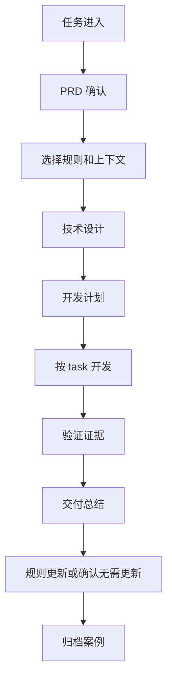

# 团队最小落地包：从一套目录、一条流程、三类规则开始

前面的文章分别讲了共享运行时、SPEC、复杂需求拆分、有界上下文、阶段化交付、Task 化开发、验证治理、资产沉淀、Agent 分层和多工具适配。真正落地时，团队不需要一次性实现全部能力。更现实的方式，是先做一个最小闭环：任务能进来，需求能确认，规则能被引用，计划能拆 task，验证有证据，交付后能总结和归档。

最小落地包的目标，是让团队用较低成本建立第一套 AI Coding 工程边界。它不追求平台完整，也不追求自动化程度最高；它只要求每次 AI Coding 任务都有状态、有产物、有规则、有验证、有沉淀。

> 一句话结论：**不要从大平台开始，先让一个真实需求完整跑完最小闭环。**

## 一、先选对试点需求

最小落地包成败，首先取决于试点需求选得对不对。不要一上来选“全链路重构”“跨十几个应用联调”“历史包袱极重”的需求，也不要选只改一个文案的需求。前者会把流程问题和业务复杂度混在一起，后者又看不出团队化价值。

更适合试点的需求通常有这些特征：

| 维度 | 推荐选择 | 不推荐选择 |
|---|---|---|
| 业务范围 | 一个明确功能点或一个小流程 | 多条业务线同时改造 |
| 代码范围 | 2-5 个核心模块，可列出主要文件 | 影响范围无法提前判断 |
| 验证方式 | 有单测、集成测试或明确回归命令 | 只能靠人工点页面 |
| 规则沉淀 | 有可复用业务规则或工程规范 | 一次性临时处理 |
| 风险级别 | 中低风险，可回滚 | 强资金、强合规、强线上实时风险 |

试点不是为了证明 AI “什么都能做”，而是为了证明团队能把 AI Coding 过程纳入工程闭环。

## 二、最小闭环



这条闭环里，自动化可以逐步增强，但产物边界不要省。

### 最小目录模板

可以从下面这个目录开始：

```text
.team-agent/
├── current-task
├── workflow/
│   └── phases.json
├── tools/
├── spec/
│   ├── team/
│   │   ├── index.md
│   │   ├── architecture.md
│   │   ├── implementation.md
│   │   ├── verification.md
│   │   └── delivery.md
│   └── app/
│       ├── profile.md
│       ├── index.md
│       ├── domain/
│       ├── business/
│       └── engineering/
├── tasks/
│   └── {taskId}/
│       ├── task.json
│       ├── prd.md
│       ├── design.md
│       ├── plan.md
│       ├── plan.tasks.json
│       ├── summary.md
│       ├── context/
│       │   ├── prd.jsonl
│       │   └── code.jsonl
│       └── evidence/
│           └── verification-ledger.jsonl
└── archive/
    └── index.jsonl
```

这里最重要的是 owner 清晰：

- `task.json` 是状态。
- Markdown 是稳定产物。
- `context/` 是阶段上下文。
- `evidence/` 是验证证据。
- `spec/` 是长期规则。
- `archive/` 是历史案例。

### 最小数据结构

`task.json`：

```json
{
  "taskId": "T-001",
  "status": "in_progress",
  "currentPhase": "plan_delivery",
  "branch": "feature/prize-type",
  "artifacts": {
    "prd": "prd.md",
    "design": "design.md",
    "plan": "plan.md",
    "summary": "summary.md"
  }
}
```

`plan.tasks.json`：

```json
{
  "tasks": [
    {
      "id": "T1",
      "title": "实现新增权益类型识别",
      "featureId": "feature-01",
      "allowedPaths": ["src/main/java/...", "src/test/java/..."],
      "verificationCommands": ["mvn test -Dtest=PrizeTypeServiceTest"],
      "acceptanceCriteria": ["新权益类型可识别", "存量类型行为不变"]
    }
  ]
}
```

`verification-ledger.jsonl`：

```json
{"taskId":"T1","stage":"baseline","command":"mvn test -Dtest=PrizeTypeServiceTest","status":"passed"}
{"taskId":"T1","stage":"green","command":"mvn test -Dtest=PrizeTypeServiceTest","status":"passed","classification":"passed","blocksCurrentTask":false}
```

`archive/index.jsonl`：

```json
{"taskId":"T-001","title":"新增权益类型","domain":["奖品"],"changedAreas":["PrizeTypeService"],"summaryPath":".team-agent/archive/T-001/summary.md"}
```

这些结构不需要一开始很复杂，但要稳定。后续自动化、UI、统计都可以基于它们演进。

### 最小规则体系

先建三类规则：

| 目录 | 先放什么 |
|---|---|
| `spec/team/` | 团队通用架构、实现、验证、交付规则 |
| `spec/app/domain/` | 应用领域模型、状态、不变量 |
| `spec/app/business/` | 可复用业务需求开发规则 |
| `spec/app/engineering/` | 应用工程规范、测试命令、中间件规则 |

每条 focused Spec 至少包含：

```md
# 规则标题

## Overview

## How To Apply

## Rules

## DO / DON'T

## Checklist

## Source Reference
```

第一阶段可以先人工选择相关规则；第二阶段再做 selector。

### 最小流程规范

每个任务必须经过：

1. `prd.md`：确认后的需求。
2. `design.md`：技术方案。
3. `plan.md` + `plan.tasks.json`：可执行计划。
4. task 开发：每次只做一个 task。
5. `verification-ledger.jsonl`：验证证据。
6. `summary.md`：交付总结。
7. Spec disposition：更新规则或确认无需更新。
8. archive：归档历史案例。

如果团队暂时没有自动控制平面，也可以用人工 checklist 驱动。关键是产物和证据不能省。

## 三、每天怎么跑

试点阶段不要只设计流程，还要规定每天怎么用。一个简单节奏就够：

| 时间点 | 动作 | 产物 |
|---|---|---|
| 开始前 10 分钟 | 确认当前 task、阶段、阻塞项 | `task.json`、当前阶段 |
| 设计前 | 检查 PRD 是否有范围、非目标、验收 | `prd.md` |
| 开发前 | 审计划和 task contract | `plan.md`、`plan.tasks.json` |
| 每个 task 完成后 | 看 diff 和验证证据 | staged diff、ledger |
| 每天结束前 | 更新阻塞、风险和下一步 | `task.json`、简短记录 |
| 交付后 | 补 summary、规则处置和归档 | `summary.md`、archive index |

这个节奏的价值不是增加仪式感，而是让团队每天都能回答：现在做到哪、为什么能继续、哪里不能继续。

## 四、30 天推进建议

| 时间 | 目标 | 产物 |
|---|---|---|
| 第 1 周 | 建目录和模板 | `.team-agent/`、PRD/Design/Plan/Summary 模板 |
| 第 2 周 | 选 1-2 个真实需求试跑 | task 目录、plan.tasks.json、ledger |
| 第 3 周 | 沉淀第一批 SPEC | team spec、app profile、business spec |
| 第 4 周 | 复盘和归档 | summary、archive index、流程调整 |

不要一开始追求全自动。先让一个真实需求完整跑完，再根据痛点补自动化。

### 最小指标

试点要有指标，但不要一开始就做复杂报表。先观察五类信号：

| 指标 | 看什么 | 判断方式 |
|---|---|---|
| 接手成本 | 换人后能否在 10 分钟内知道当前状态 | 看 task、artifact 和 ledger 是否完整 |
| 计划可执行性 | worker 是否频繁退回计划阶段 | 统计 plan contract 缺失次数 |
| Diff 可审查性 | reviewer 是否能按 task 审 diff | 看每个 task 是否有明确 allowed paths 和验收 |
| 验证可信度 | 测试失败是否能分类 | 看 baseline、green、regression 记录 |
| 资产复用 | 下个相似需求是否引用了历史案例或规则 | 看 summary、spec disposition、archive recall |

这些指标不追求漂亮，重点是暴露团队 AI Coding 流程里最先需要补的短板。

### 失败预案

试点失败通常不是因为 AI 不够强，而是边界没立住。可以提前约定几条处理规则：

| 失败信号 | 处理动作 |
|---|---|
| PRD 反复变化 | 停止开发，回到 PRD 确认，不让 worker 继续改代码 |
| 计划 task 太大 | 退回计划阶段，按文件范围、验收标准和验证命令重新拆 |
| 验证命令缺失 | 不允许用“手动看起来正常”替代 ledger |
| Diff 超出 allowed paths | 阻塞 review，要求解释或拆分 |
| 规则过期导致误导 | 在 summary 里记录 spec disposition，交付后更新或废弃 |

这几条看起来简单，但能避免试点变成“AI 写了一堆代码，最后靠人兜底”。

## 五、检查清单

- 是否有统一任务目录？
- 是否有状态真相源？
- 是否有 PRD、设计、计划、总结四类稳定产物？
- 是否有规则目录，而不是只靠 Prompt？
- 是否有 task 级开发计划？
- 是否有验证 ledger？
- 是否有交付后的规则处置？
- 是否有 archive index？
- 是否能用一个真实需求完整跑完闭环？

## 六、思考与实践

1. 如果只给 30 天，你们团队最应该先补任务状态、SPEC、上下文，还是验证 ledger？
2. 选一个即将开始的真实需求，你能否用这篇文章的最小目录把它完整跑一遍？
3. 如果你准备在团队试点，最需要争取谁的支持：研发负责人、架构师、测试负责人，还是效能团队？

## 七、结尾

团队 AI Coding 工程化不需要从大平台开始。先建立最小闭环：目录、流程、规则、task、验证、总结、归档。只要这个闭环稳定，后续再补上下文选择、多工具适配、协作工作台和指标化评估，系统就会自然长出来。
