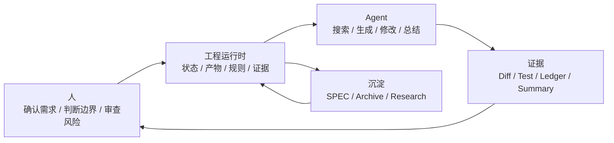

# 写在最后：AI Coding 团队化，最后还是工程问题

这个系列写到这里，已经从共享运行时、SPEC、需求拆分、有界上下文、阶段化交付、Task 化开发、验证治理、资产沉淀、Agent 分层、多工具适配、协作面，一直写到了团队最小落地包。

如果只看目录，容易觉得这套东西有点“重”。AI Coding 不就是让 AI 帮我们写代码吗，为什么要讲这么多状态、规则、产物、上下文、证据和归档？

原因也很简单：个人用 AI Coding，靠的是个人判断；团队用 AI Coding，靠的是工程边界。一个人知道该给哪些上下文，知道模型哪里容易乱写，知道哪些测试失败是历史问题，也知道代码改到什么程度该停。但这些判断如果一直留在个人脑子里，团队就没有办法复制、审查和接手。

这个系列想讨论的，其实不是“怎么把 AI 用得更猛”，而是怎么让 AI Coding 进入团队已有的工程秩序。

> 一句话结论：**AI Coding 团队化的终点，不是做出一个更大的 Agent，而是让需求、上下文、规则、验证和沉淀都变成团队可接手的工程资产。**

## 一、这个系列真正想留下什么

如果要把前面所有文章压缩成一句话，我会这样说：

> 团队 AI Coding 不是把研发流程交给 AI，而是把 AI 放进一个可审查、可恢复、可验证的研发流程里。

这句话里有几个关键词。

| 关键词 | 解决什么问题 | 对应文章 |
|---|---|---|
| 可审查 | 不再只看聊天记录，而是看 PRD、设计、计划、diff 和证据 | 阶段化交付、Task 化开发、协作面 |
| 可恢复 | 换人、换会话、换工具后，任务还能继续 | 共享运行时、状态真相源、多工具适配 |
| 可验证 | AI 不能只说“应该没问题”，必须留下命令、结果和失败分类 | 验证治理 |
| 可复用 | 每次交付后，经验要进入规则、案例和研究资产 | SPEC、资产沉淀 |
| 可控制 | 上下文、任务范围、Agent 职责都有边界 | 有界上下文、需求拆分、Agent 分层 |

这些能力听起来不像“AI 技巧”，更像研发效能、架构治理和工程协作。但这正是团队化落地绕不开的部分。

工具会继续变，模型也会变强。今天是 IDE 插件，明天是 CLI，后天可能是团队级 Agent 平台。但只要团队想稳定地把 AI 放进研发流程，就绕不开这些问题：

- 当前需求到底确认了吗？
- AI 为什么读这些文件，而不是读全仓？
- 哪些规则是长期有效的，哪些只是本次任务事实？
- 这次代码改动对应哪个 task 和验收标准？
- 测试失败是历史失败、本次回归，还是缺少环境？
- 交付后有什么经验会进入下一次任务？
- AI 卡住时，人能不能接手？

能把这些问题回答清楚，团队才算真正开始建设 AI Coding 能力。

## 二、不要把这个系列读成“造平台指南”

这个系列反复讲运行时、目录、数据结构、协作面，很容易被误读成：团队必须先造一个平台，才能用好 AI Coding。

我不这么看。

大多数团队第一步不需要平台，甚至不需要自动化。第一步应该是把一个真实需求跑清楚：需求怎么确认，规则怎么引用，计划怎么拆，验证怎么留证据，交付后怎么总结。

真正危险的不是“工具太简陋”，而是下面几种情况：

| 现象 | 看起来像 | 实际问题 |
|---|---|---|
| Agent 能一口气改很多文件 | 效率高 | 缺少 task 边界，review 很难接住 |
| Prompt 里写满规则 | 很全面 | 规则没有来源、生命周期和审查机制 |
| 每个应用都有自己的 Agent | 很贴业务 | 通用流程重复建设，行为不一致 |
| AI 解释测试失败无关 | 很懂项目 | 没有 baseline 和 ledger，无法审计 |
| 每次都能靠高手救回来 | 团队有经验 | 经验没有资产化，换人后继续波动 |

所以这个系列不是劝大家一上来做大系统。相反，它一直在强调最小闭环：先让状态、产物、规则、验证、总结这几件事稳定下来。

平台可以晚一点，自动化也可以晚一点。边界不能太晚。

## 三、AI Coding 不是替代工程习惯，而是放大工程习惯

AI Coding 很容易暴露一个团队原本就存在的问题。

如果需求本来就说不清，AI 会把不清楚的部分编成看似完整的方案。

如果代码边界本来就混乱，AI 会沿着混乱边界继续扩散改动。

如果测试本来就长期失败，AI 会给出一堆“可能无关”的解释。

如果规则本来就只存在老员工脑子里，AI 每次都要重新猜。

这不是 AI 特有的问题。只是 AI 写得快，放大得也快。

所以团队推进 AI Coding 时，最好不要只问“模型能不能做”。更应该问：

| 问题 | 如果答案不清楚，先补什么 |
|---|---|
| 需求边界清楚吗？ | PRD 结构化和功能切片 |
| 规则在哪里？ | Team SPEC 和 App SPEC |
| 上下文为什么是这些？ | Working set 和选择证据 |
| 代码改动能拆开审吗？ | task contract 和 allowed paths |
| 验证结果可信么？ | baseline、green、regression ledger |
| 做完后能复用吗？ | summary、spec disposition、archive index |

AI 不是用来绕过这些工程习惯的。它更适合承担搜索、整理、草拟、局部实现、补测试、生成总结这些执行工作。边界、取舍、验收和风险判断，仍然要由团队负责。

一个比较稳的分工是：



这张图里，AI 很重要，但它不是唯一中心。真正的中心是工程运行时和团队判断。

## 四、一个团队可以怎么继续往下走

如果读完这个系列，准备在团队里试一下，我建议不要从“建设完整 AI Coding 平台”开始。可以从一个 30 天小试点开始。

### 第一步：选一个真实需求

不要选太大的重构，也不要选只改文案的小需求。最好是一个中低风险、边界可控、能写出验收标准、能跑验证命令的真实功能点。

目标不是证明 AI 能写多少代码，而是证明团队能把一次 AI Coding 任务完整接住。

### 第二步：建最小目录

不用一开始把所有工具都做完。先有这些文件就够：

```text
.team-agent/
├── current-task
├── spec/
│   ├── team/
│   └── app/
├── tasks/
│   └── {taskId}/
│       ├── task.json
│       ├── prd.md
│       ├── design.md
│       ├── plan.md
│       ├── plan.tasks.json
│       ├── summary.md
│       └── evidence/
│           └── verification-ledger.jsonl
└── archive/
    └── index.jsonl
```

这套目录不是重点，职责才是重点：状态归状态，产物归产物，规则归规则，证据归证据，历史案例归历史案例。

### 第三步：先把人工流程跑通

第一轮可以完全人工驱动：

1. 需求负责人确认 `prd.md`。
2. 架构或负责人审 `design.md`。
3. 开发负责人审 `plan.md` 和 `plan.tasks.json`。
4. 每个 task 只允许改约定范围内的文件。
5. 每次验证写入 `verification-ledger.jsonl`。
6. 交付后补 `summary.md`。
7. 判断是否更新 SPEC，最后归档案例。

跑完一轮后，再决定哪些地方值得自动化。通常最先值得做的是模板生成、验证记录、上下文选择和归档索引。不要一开始就把所有流程都做成复杂系统。

### 第四步：看五个指标

试点结束后，不要只看“节省了多少人天”。更应该看这五个信号：

| 指标 | 问法 |
|---|---|
| 接手成本 | 换一个人，10 分钟内能知道任务状态和下一步吗？ |
| 计划质量 | task 是否小到可执行、可审查、可验证？ |
| Diff 收敛 | 代码改动是否围绕当前 task，没有顺手扩散？ |
| 验证可信度 | 测试失败是否能分类，是否有 baseline 对比？ |
| 资产复用 | 下一个相似需求能不能引用这次的规则或案例？ |

这些指标比“AI 写了多少代码”更接近团队能力。

## 五、最后应该坚持的几条底线

AI Coding 会继续变快，工具也会继续把流程包装得更顺。但团队要留几条底线。

第一，**需求没确认，不要急着改代码。** 模型越强，越容易把模糊需求补成一个看起来完整的方案。

第二，**规则不要只放 Prompt。** Prompt 可以承接流程，长期规则要有来源、适用边界和更新机制。

第三，**上下文不是越多越好。** 给 Agent 的上下文应该能解释为什么被选中，而不是把整个仓库都塞进去。

第四，**没有验证证据，就不要轻易说完成。** 测试命令、结果、失败分类和阻塞判断要留下来。

第五，**交付不是合代码就结束。** 总结、规则处置和归档，决定了下一次任务能不能少走弯路。

第六，**不要让一个万能 Agent 包办所有事。** 控制、设计、执行、评审、总结最好有清楚边界。

第七，**人不要从流程里消失。** AI 可以承担大量执行工作，但边界、优先级、风险和验收仍然需要人负责。

这几条不新鲜，甚至有点像工程常识。但 AI Coding 团队化最后拼的，恰恰就是这些常识能不能落到日常流程里。

## 六、思考与实践

1. 你们团队现在 AI Coding 最不稳定的环节，是需求、上下文、代码 diff、验证，还是交付沉淀？
2. 如果只选一个真实需求试点，你会先补 `task.json`、SPEC、`plan.tasks.json`，还是 verification ledger？
3. 你们团队有没有一个地方，可以让新人不看聊天记录，也能接手 AI 正在做的任务？

## 七、结尾

这个系列到这里就收住。

如果你只记住一件事，我希望是：AI Coding 的团队化，不是把每个人都训练成 Prompt 高手，也不是让一个 Agent 接管研发流程。更可靠的路径，是把个人经验里可复用、可审查、可验证的部分，变成团队共同拥有的工程资产。

从一个真实需求开始，把状态写清楚，把需求确认好，把规则放到该放的位置，把上下文选准，把计划拆小，把验证证据留下，把交付经验沉淀下来。

这件事不酷，但有用。

等这些基础动作稳定之后，团队再谈更强的 Agent、更顺的协作面、更自动化的运行时，才有意义。
