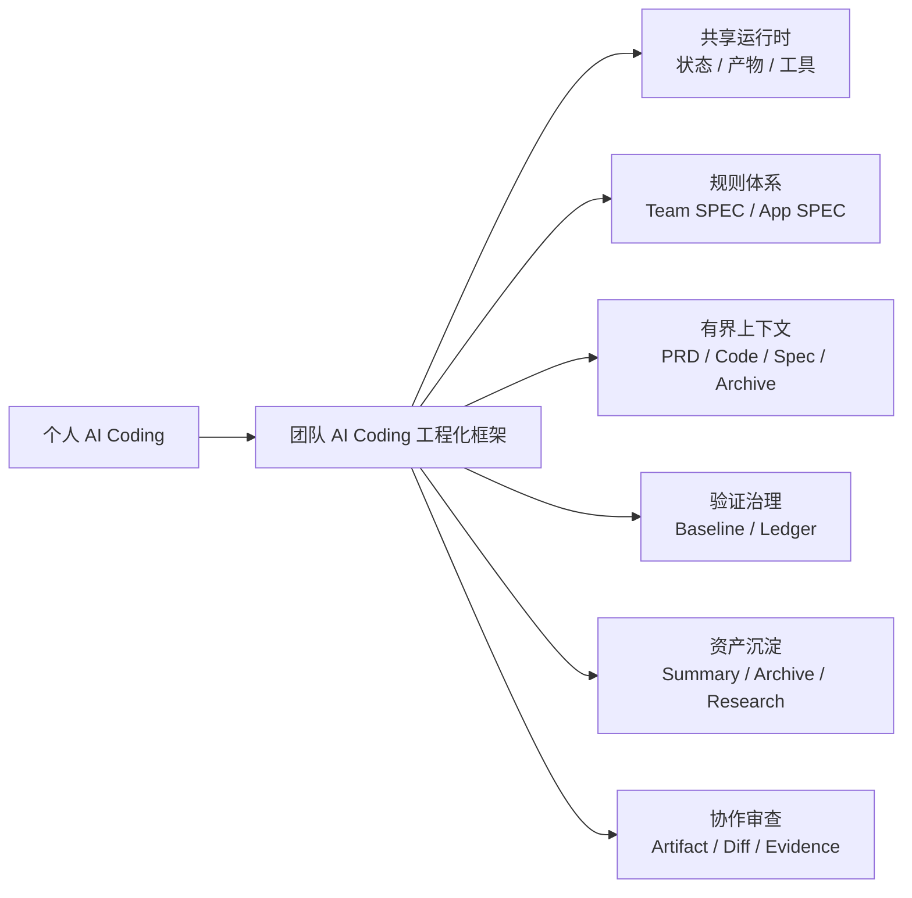

# AI Coding 团队化实战

**从个人提效到工程化落地**

本仓库是微信公众号专栏[《AI Coding 团队化实战》](https://mp.weixin.qq.com/mp/appmsgalbum?__biz=MzYzNTkzMDY0NA==&action=getalbum&album_id=4524444444661940224#wechat_redirect)的 GitHub 版本，用于集中阅读、版本化维护和团队内部讨论。文章尽量使用通用示例，读者可以把其中的目录、命令、数据结构替换成自己团队的工具链和平台对象。

你可能已经见过很多 AI Coding 的个人提效案例：一个研发同学用 AI 读代码、写实现、补测试，效率确实提升明显。但团队真正推进时，问题往往不是“大家会不会用工具”，而是：

- 为什么一个人用得很顺，换个人就不稳定？
- 为什么每个应用都想自己写一套 Agent？
- 为什么 Prompt 越写越长，规则却越来越不可信？
- 为什么大 PRD 交给 AI 后，经常变成大方案、大计划、大 diff？
- 为什么 AI 说“测试失败和本次改动无关”，团队还是不敢信？
- 为什么 AI 交付过的经验，下次需求还是用不上？

这个系列尝试回答一个更底层的问题：

> **AI Coding 的团队化问题，不是让每个人更会提问，而是让团队有一套能承接需求、上下文、规则、验证、协作和沉淀的工程系统。**

系列中的目录、命令和数据结构都使用通用示例，读者可以替换成自己团队的工具链和平台对象。

## 如何使用这个仓库

- 如果是第一次阅读，建议先看下面的“推荐阅读路径”。
- 如果准备在团队内共读，可以直接把 `README.md` 和具体文章链接发到内部群或 Wiki。
- 如果发现错字、链接错误或实践问题，可以通过 Issue 反馈，也可以直接提交 Pull Request。
- 当前仓库采用 Apache License 2.0，转载和引用说明见 [COPYRIGHT.md](./COPYRIGHT.md)。

## 适合谁看

这个系列适合四类读者：

- 正在推动 AI Coding 在团队内规模化使用的技术负责人。
- 需要建设 Agent、Command、Skill、Prompt、规则库的效能或平台团队。
- 已经有个人 AI Coding 经验，但发现团队复用效果不稳定的研发团队。
- 想把 AI Coding 纳入需求、设计、开发、验证、评审流程的架构师和工程负责人。

这个系列不是 Prompt 技巧合集，而是面向研发团队的工程化实践。如果你正在思考“怎么让一个团队稳定用好 AI”，这套内容会更有价值。

## 适合转发给团队讨论的 6 个问题

如果你不确定这个系列是否适合自己的团队，可以先把下面 6 个问题拿去内部讨论：

1. 我们团队 AI Coding 的最佳实践，是不是还主要掌握在少数几个人手里？
2. 我们是否在不同应用里重复建设 Agent、Prompt、Skill 和规则？
3. 我们的业务规则和工程规范，是不是还主要靠 Prompt、Wiki 或口头经验维护？
4. 我们给 AI 的上下文，是不是经常靠手动复制和临场判断？
5. AI 说测试失败“可能无关”时，我们有没有可审计的证据链？
6. 一次 AI 交付结束后，经验是否能进入下一次任务，而不是留在聊天记录里？

如果这些问题有 3 个以上答案不确定，就说明团队已经需要从“个人会用”进入“团队工程化使用”的阶段。

## 推荐阅读路径

第一次阅读，不建议从架构细节开始。建议按“痛点强、收益明显、容易传播”的顺序读：

1. [个人会用 AI Coding，为什么团队还是用不好？](./00-overview.md)
2. [共享运行时：不要让每个应用都重复建设 Agent](./01-shared-runtime.md)
3. [SPEC 体系：把规则从 Prompt 里拿出来](./02-spec-system.md)
4. [复杂需求拆分：大 PRD 不能直接丢给 Agent](./03-requirement-slicing.md)
5. [有界上下文：不是给 Agent 更多，而是给得更准](./04-bounded-context.md)
6. [验证治理：AI 说“测试失败无关”是不够的](./07-verification-governance.md)

这 6 篇读完，基本就能建立团队 AI Coding 工程化的主干认知。

## 系列文章

| 序号 | 文章 | 核心问题 | 推荐阅读理由 |
|---|---|---|---|
| 00 | [个人会用 AI Coding，为什么团队还是用不好？](./00-overview.md) | 团队 AI Coding 到底缺哪几类工程能力 | 系列总纲，适合转发给团队一起讨论 |
| 01 | [共享运行时：不要让每个应用都重复建设 Agent](./01-shared-runtime.md) | 如何避免每个应用各写一套 Agent、Prompt、Skill | 解决重复建设问题 |
| 02 | [SPEC 体系：把规则从 Prompt 里拿出来](./02-spec-system.md) | 如何让规则可检索、可审查、可持续维护 | 解决 Prompt 失控和规则过期问题 |
| 03 | [复杂需求拆分：大 PRD 不能直接丢给 Agent](./03-requirement-slicing.md) | 如何把大需求变成 Agent 能稳定消费的功能切片 | 解决复杂需求不稳定问题 |
| 04 | [有界上下文：不是给 Agent 更多，而是给得更准](./04-bounded-context.md) | 如何控制 PRD、代码、规则、历史案例进入模型的范围 | 解决上下文失控问题 |
| 05 | [阶段化交付：别让 AI 从一句话直接改代码](./05-artifact-delivery.md) | 如何让 PRD、设计、计划、总结成为稳定产物 | 解决聊天驱动不可审查问题 |
| 06 | [Task 化开发：把大 Diff 拆成可审查的工程任务](./06-task-development-review.md) | 如何让实现过程按 task、diff、证据收敛 | 解决大 diff 难治理问题 |
| 07 | [验证治理：AI 说“测试失败无关”是不够的](./07-verification-governance.md) | 如何区分历史失败和本次回归 | 解决质量证据不可信问题 |
| 08 | [资产沉淀：让每次交付反哺下一次任务](./08-asset-flywheel.md) | 如何让经验进入后续需求，而不是留在聊天里 | 解决知识无法复用问题 |
| 09 | [Agent 分层：不要让一个万能 Agent 包办所有事](./09-adapter-agent-layering.md) | 如何划分控制、构建、研究、执行、评审职责 | 解决单 Agent 职责过重问题 |
| 10 | [多工具适配：把共享语义放 Runtime，把工具差异放 Adapter](./10-adapter-tooling.md) | 如何避免绑定单一 AI Coding 工具 | 解决工具迁移和重复适配问题 |
| 11 | [协作面：团队如何审查和接管 Agent 产物](./11-workspace-collaboration.md) | 如何围绕 artifact、diff、evidence 协作 | 解决团队审查和接管问题 |
| 12 | [团队最小落地包](./12-minimal-playbook.md) | 如何从最小目录、流程、规则和证据开始 | 适合拿回团队做试点 |

## 这个系列的核心框架

团队 AI Coding 不是“多写几个 Agent”，而是补齐一组工程边界：

## 术语说明

| 术语 | 在系列中的含义 | 可替换成 |
|---|---|---|
| 团队 AI Coding 工程化框架 | 承接 AI Coding 工具和团队研发流程的工程系统 | 自研 Agent 平台、研发效能脚手架、团队 AI 工具链 |
| 共享运行时 | Agent 共享的状态、产物、工具和上下文目录 | `.team-agent/`、`.ai-agent/`、项目内运行时目录 |
| Agent | 承担某类职责的 AI 执行单元 | 设计助手、计划助手、开发助手、评审助手 |
| SPEC | 可被 Agent 消费的规则、规范、领域知识和案例沉淀 | 团队规范、应用知识库、工程约束、业务规则 |
| Adapter | 把不同 AI 工具接入同一套流程的适配层 | IDE 插件适配、CLI 适配、平台接入层 |
| Artifact | 稳定阶段产物 | PRD、设计文档、计划、总结、验证证据 |
| Working Set | 某个阶段刚好需要的上下文包 | PRD 片段、代码引用、规则、历史案例 |
| Verification Ledger | 验证命令、结果和失败分类的证据链 | 测试记录、CI 证据、质量流水 |
| Feature Room | 一个需求的协作审查空间 | 需求空间、任务房间、评审工作台 |

## 每篇文章会怎么写

每篇文章都按同一套标准写：

- **有痛点**：开头直接进入真实研发场景。
- **有观点**：每篇都有一句可带走的核心判断。
- **有案例**：包含目录结构、数据结构、流程图和维护动作。
- **有自查**：帮助读者对照自己团队现状。
- **有互动**：每篇结尾都有思考与实践问题，方便评论区讨论。
- **有克制**：不把 AI 描述成替代研发流程，也不把单一实现说成唯一答案。

## 关注这个系列，你会得到什么

读完这个系列，你应该能回答这些问题：

- 团队 AI Coding 需要补哪些工程能力？
- 为什么规则不能继续堆在 Prompt 里？
- 大 PRD 怎么拆成 AI 能稳定消费的功能点？
- 什么叫有界上下文，为什么不是上下文越多越好？
- AI 修改代码后，测试失败怎么判断是不是本次回归？
- 如何让每次 AI 交付沉淀成下一次任务可用的资产？
- 如果团队只做一个最小试点，应该从哪里开始？

如果这些问题正好是你团队正在面对的，也欢迎把这个系列转给团队里的架构师、研发负责人和效能同学一起讨论。

## 评论区可以聊什么

每篇文章结尾都会保留 2-3 个思考与实践问题。欢迎带着真实团队场景讨论，尤其是下面几类问题：

- 你们团队现在最难稳定落地的 AI Coding 环节是什么？
- 你们是否已经有自己的 Agent、Prompt、SPEC 或规则库？
- 复杂需求交给 AI 时，最容易失控的是需求理解、上下文、代码 diff，还是验证？
- 如果只能先做一个最小试点，你们会从哪一类能力开始？

这些真实问题会反过来影响后续文章的案例选择和展开深度。

## 联系我
关注公众号，获取技术分享与更新：

